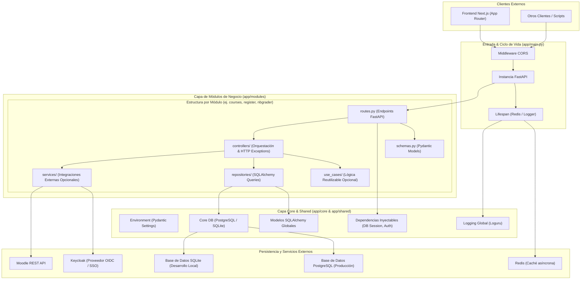
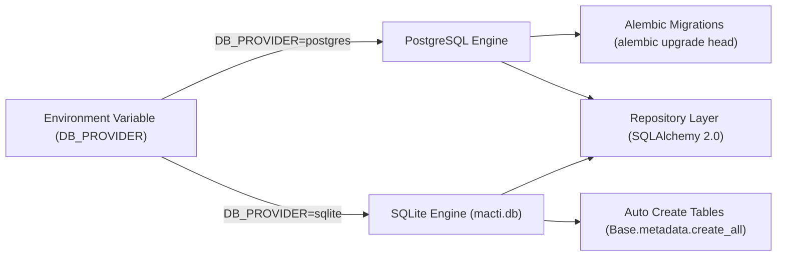

# 🏛️ Arquitectura del Backend - MACTI-API

> **Framework**: FastAPI 0.120+ | **Lenguaje**: Python 3.12+ | **Base de Datos**: PostgreSQL / SQLite | **ORM**: SQLAlchemy 2.0 | **Gestor**: uv

---

## 1. 📌 Introducción y Visión General

El backend de la plataforma **MACTI** (**MACTI-API**) está diseñado como una API REST moderna, asíncrona, robusta y escalable construida sobre **FastAPI** y **Python 3.12+**. Su objetivo principal es concentrar la lógica de negocio central, la gestión de cuentas e identidades de usuario, la administración de recursos académicos, la sincronización con Moodle y la integración con entornos de notebooks interactivos (Jupyter / nbgrader) en la UNAM.

La arquitectura sigue una **variante del patrón MVCS (Model-View-Controller-Service)** adaptada a la metodología de **Domain-Driven Design (DDD)** modularizado. El código está organizado en capas claramente delimitadas (Core, Shared y Modules), promoviendo la inyección de dependencias, la reutilización de código y el desacoplamiento entre el acceso a datos y los controladores de la aplicación.

> [!IMPORTANT]
> **Persistencia y Acceso a Base de Datos en el Backend**:
> 1. **Fuente Única de Verdad de Negocio**: La API Backend es responsable de la persistencia y gestión integral de los datos de negocio (usuarios, cursos, inscripciones, entregas y tareas).
> 2. **Soporte Dual de Motores de BD**: El sistema soporta **PostgreSQL** para entornos de producción/staging y **SQLite** para desarrollo local rápido, alternando dinámicamente según la variable `DB_PROVIDER`.
> 3. **Patrón Repository Obligatorio**: **Todo acceso a la base de datos** (lecturas, escrituras, transacciones SQLAlchemy) debe encapsularse en la capa de `repositories/` dentro de cada módulo. Queda strictly prohibido ejecutar consultas ORM en controladores o rutas.
> 4. **Migraciones con Alembic**: Las migraciones con Alembic aplican **únicamente a PostgreSQL** (producción). No se generan archivos de migración para SQLite.

---

## 🛠️ 2. Stack Tecnológico

| Capa / Dominio | Tecnología / Herramienta | Versión Principal | Descripción |
|---|---|---|---|
| **Framework Base** | FastAPI | `0.120+` | Framework web de alto rendimiento asíncrono (ASGI) basado en Pydantic y Type Hints. |
| **Lenguaje** | Python | `3.12+` | Tipado estático con `typing`, sintaxis moderna y rendimiento mejorado. |
| **Gestor de Paquetes** | uv (Astral) | - | Administrador ultrarrápido de entornos virtuales y dependencias Python. |
| **ORM & Persistencia** | SQLAlchemy | `2.0+` | Mapeo objeto-relacional (declarative mapping) con soporte asíncrono. |
| **Base de Datos (Producción)** | PostgreSQL (psycopg3) | `16+` | BD relacional robusta con soporte para pooling de conexiones y tipos avanzados. |
| **Base de Datos (Desarrollo)** | SQLite | `3` | BD relacional ligera en archivo local (`macti.db`) para entorno de desarrollo. |
| **Migraciones de BD** | Alembic | `1.18+` | Control de versiones y migraciones automáticas del esquema relacional en PostgreSQL. |
| **Caché y Mensajería** | Redis | `8.0+` | Cliente asíncrono para almacenamiento en caché y gestión de sesiones/tokens efímeros. |
| **Validación de Esquemas** | Pydantic v2 | `2.12+` | Validación estricta y serialización de datos de entrada/salida en los endpoints. |
| **Configuración de Entorno** | Pydantic Settings | `2.11+` | Carga tipada de variables de entorno desde `.env`. |
| **Servidor ASGI** | Uvicorn / FastAPI CLI | `0.38+` | Servidor web asíncrono para desarrollo y producción. |
| **Logging** | Loguru | `0.7+` | Logger estructurado, decorado y configurable a nivel global. |
| **Cliente HTTP Asíncrono** | HTTPX | `0.28+` | Cliente HTTP para consumir microservicios y APIs externas (Keycloak, Moodle). |
| **Calidad & Formateo** | Ruff | `0.14+` | Linter y formateador ultrarrápido escrito en Rust (reemplazo de Flake8, Black e isort). |

---

## 🏗️ 3. Estructura de Directorios (`app/`)

El código fuente principal reside en la carpeta `app/` y se organiza en tres pilares principales (Core, Shared y Modules) junto al archivo de entrada principal:

```
backend/
├── app/                           # Código fuente principal de la API
│   ├── main.py                    # Inicialización de FastAPI, middlewares (CORS), lifespans y routers
│   │
│   ├── core/                      # Configuración central del sistema e infraestructura
│   │   ├── db/                    # Motores de base de datos (PostgreSQL / SQLite) y sesión SQLAlchemy
│   │   │   ├── database.py        # Configuración dinámica del engine y sessionmaker
│   │   │   └── alembic/           # Scripts y versiones de migraciones Alembic (PostgreSQL)
│   │   ├── environment.py         # Configuración global tipada con Pydantic Settings
│   │   ├── logging/               # Inicialización y formato de logs con Loguru
│   │   └── cache/                 # Cliente y conexión asíncrona de Redis
│   │
│   ├── shared/                    # Recursos globales compartidos entre módulos
│   │   ├── models/                # Modelos declarativos SQLAlchemy mapeados a tablas
│   │   │   └── __init__.py        # Registro obligatorio de modelos para auto-detección de Alembic
│   │   ├── services/              # Servicios e integraciones globales (ej. cliente Redis, utilidades)
│   │   └── dependencies/          # Inyección de dependencias de FastAPI (sesiones de BD, autenticación)
│   │
│   └── modules/                   # Módulos de negocio independientes (DDD / MVCS)
│       ├── register/              # Dominio de registro e inscripción de usuarios
│       ├── courses/               # Dominio de administración de cursos y asignaciones
│       ├── nbgrader/              # Dominio de integración con Jupyter / nbgrader
│       ├── cache/                 # Dominio auxiliar para gestión y purga de caché
│       └── temp/                  # Dominio temporal/auxiliar para desarrollo local
│           │
│           ├── routes.py          # Definición de endpoints FastAPI y enrutadores del módulo
│           ├── schemas.py         # Modelos de validación de entrada/salida (Pydantic BaseModel)
│           ├── controllers/       # Lógica de orquestación de negocio, control de flujo y excepciones HTTP
│           ├── repositories/      # Capa de datos dedicada (consultas y escrituras SQLAlchemy)
│           ├── use_cases/         # (Opcional) Funciones reutilizables entre controladores del módulo
│           └── services/          # (Opcional) Consumo y comunicación exclusiva con APIs externas
│
├── utils/                         # Scripts auxiliares y herramientas de desarrollo
├── alembic.ini                    # Configuración global del CLI de Alembic
├── pyproject.toml                 # Configuración de dependencias (uv), Ruff y herramientas
└── Dockerfile                     # Configuración de contenedorización Docker para despliegue
```

---

## 🧩 4. Capas de la Arquitectura y Responsabilidades



### 4.1 Capa Core (`app/core`)
* **Propósito**: Proporcionar la infraestructura base del sistema y configuraciones globales inmutables.
* **Módulo `core/environment.py`**: Centraliza todas las variables de entorno validadas mediante `pydantic-settings`.
* **Módulo `core/db/`**: Define la conexión dinámica al motor de base de datos (`engine`) y el generador de sesiones asíncronas (`async_sessionmaker`), administrando la estrategia dual PostgreSQL / SQLite.
* **Módulo `core/logging/`**: Configura `loguru` para formatear y dirigir los eventos de log del sistema de forma estandarizada.
* **Módulo `core/cache/`**: Administra la conexión asíncrona y reconexión con Redis.

### 4.2 Capa Shared (`app/shared`)
* **Propósito**: Concentrar código, modelos y dependencias reutilizables por múltiples módulos.
* **Modelos SQLAlchemy (`shared/models/`)**: Define la estructura relacional de las tablas de la base de datos mediante SQLAlchemy 2.0. Todos los modelos deben registrarse en `shared/models/__init__.py`.
* **Dependencias (`shared/dependencies/`)**: Inyectores de dependencia de FastAPI que proveen la sesión de base de datos activa (`get_db`) o validan la autenticación de peticiones.

### 4.3 Capa de Módulos de Negocio (`app/modules`)
* **Propósito**: Agrupar la lógica por dominios funcionales desacoplados.
* Cada módulo contiene:
  * **`routes.py`**: Define las rutas HTTP (`APIRouter`), parámetros de entrada, respuestas codificadas y dependencias inyectadas.
  * **`schemas.py`**: Declara los esquemas Pydantic (`BaseModel`) de entrada (Request) y salida (Response) para validación de tipos y serialización.
  * **`controllers/`**: Implementa los casos de uso principales, coordina operaciones, realiza validaciones de negocio y eleva excepciones HTTP (`HTTPException`).
  * **`repositories/`**: Encapsula de forma estricta las operaciones CRUD y consultas complejas mediante el ORM de SQLAlchemy.
  * **`use_cases/`** *(Opcional)*: Extrae funciones de lógica pura compartidas entre controladores del mismo módulo.
  * **`services/`** *(Opcional)*: Se reserva **exclusivamente para comunicarse con APIs externas** (ej. consumo de endpoints de Moodle o Keycloak).

---

## 🔐 5. Flujos Arquitectónicos Clave

### 5.1 Flujo de Procesamiento de una Petición HTTP

El backend implementa un flujo unidireccional estricto entre capas para garantizar la mantenibilidad y la posibilidad de realizar pruebas unitarias:

```mermaid
sequenceDiagram
    autonumber
    actor Cliente as Cliente HTTP (Frontend)
    participant Route as Endpoint (routes.py)
    participant Schema as Esquema (schemas.py)
    participant Controller as Controlador (controllers/)
    participant Repository as Repositorio (repositories/)
    participant DB as Base de Datos (PostgreSQL/SQLite)

    Cliente->>Route: POST /api/v1/courses (Payload JSON)
    Route->>Schema: Valida entrada automáticamente con Pydantic
    alt JSON Inválido
        Schema-->>Cliente: Retorna 422 Unprocessable Entity
    else JSON Válido
        Route->>Controller: Invoca método del controlador pasando datos validados
        Controller->>Controller: Valida reglas de negocio (ej. duplicados)
        Controller->>Repository: Llama a método de persistencia (ej. create_course)
        Repository->>DB: Ejecuta sentencia SQL (SQLAlchemy)
        DB-->>Repository: Retorna entidad / modelo SQLAlchemy
        Repository-->>Controller: Devuelve instancia del modelo
        Controller-->>Route: Retorna resultado procesado o esquema Pydantic
        Route-->>Cliente: Retorna respuesta HTTP (201 Created + JSON)
    end
```



### 5.2 Manejo del Ciclo de Vida (`lifespan`)

FastAPI administra el arranque y apagado del sistema mediante un generador asíncrono (`asynccontextmanager`):

1. **Fase de Arranque (Startup)**:
   - Configura el sistema de logs global con `setup_logging()`.
   - Establece la conexión asíncrona con la instancia de Redis (`redis_client.connect()`).
   - Inicializa el esquema de tablas en SQLite si el entorno es de desarrollo local.
2. **Fase de Apagado (Shutdown)**:
   - Cierra de forma limpia las conexiones abiertas con Redis (`redis_client.disconnect()`).
   - Cierra el pool de conexiones de base de datos.

### 5.3 Estrategia de Base de Datos y Migraciones

> [!NOTE]
> La abstracción del patrón Repository permite cambiar o probar el acceso a datos sin modificar los controladores de negocio.



---

## 🎨 6. Seguridad, Autenticación y Control de Entorno

* **CORS (Cross-Origin Resource Sharing)**: Configurado dinámicamente en `main.py` mediante `CORSMiddleware`. En entorno de producción restringe orígenes al `FRONTEND_URL` configurado.
* **Configuración Segura de Entorno**: Implementada mediante Pydantic Settings (`app/core/environment.py`), lo que previene el arranque de la aplicación si faltan variables obligatorias o si sus tipos son incorrectos.
* **Validación de Entradas**: Pydantic v2 sanitiza y convalida automáticamente las estructuras JSON, parámetros de consulta (query params) y parámetros de ruta (path params).

---

## 🧹 7. Estándares de Calidad y Desarrollo

* **Gestión de Entorno y Paquetes**: Se utiliza **`uv`** como herramienta estándar para la gestión del entorno virtual y dependencias de Python (`pyproject.toml` y `uv.lock`).
* **Linter y Formateador**: Se exige el cumplimiento estricto de **Ruff** (`uv run ruff check` y `uv run ruff format`).
* **Docstrings Mandatorios**: Todo código nuevo o modificado (funciones, métodos, clases y módulos) debe incluir **docstrings actualizados** con descripciones claras.
* **Control de Versiones y Commits**: Los mensajes de confirmación deben redactarse en **español**, en **tiempo pasado** y siguiendo el estándar de **Conventional Commits** (ej. `feat(courses): agrego repositorio para consulta de inscripciones`).

---

## 📝 8. Documentación Relacionada

* 📋 [README Backend](../README.md): Instrucciones de instalación, configuración local y ejecución del servidor.
* 🤖 [Reglas del Agente Backend](../.agents/AGENTS.md): Directivas de desarrollo para asistentes y colaboradores en esta capa.
* 📚 [Skill Arquitectura Backend](../.agents/skills/macti-backend-arch/SKILL.md): Especificación detallada del patrón MVCS y carpetas de `app/modules`.
* 🗄️ [Skill Base de Datos Backend](../.agents/skills/macti-backend-db/SKILL.md): Reglas de SQLAlchemy, Alembic, repositorios y modelos relacionales.
