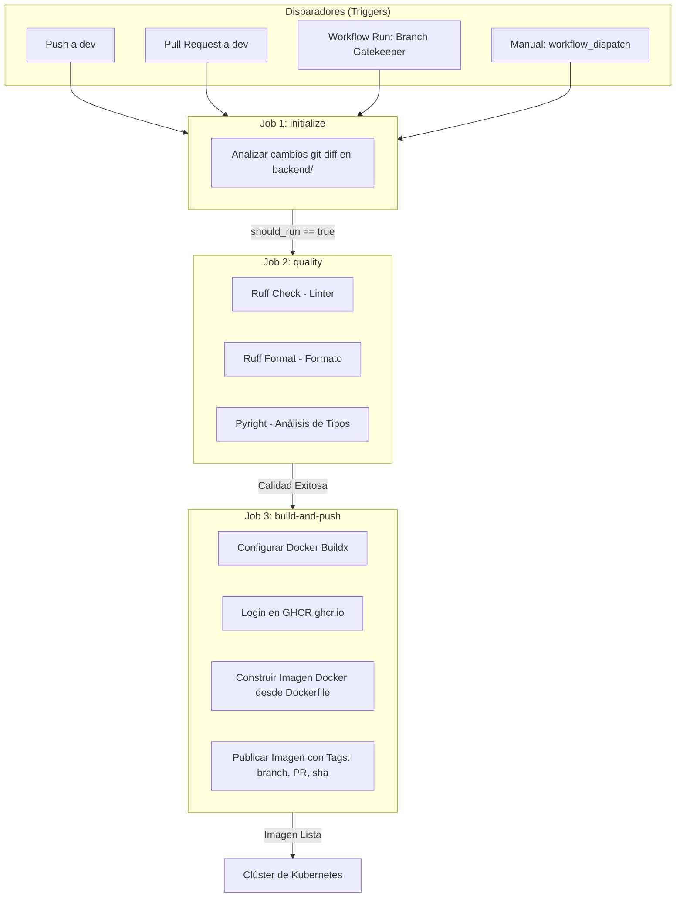
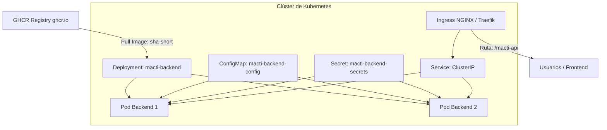

# 🔄 Pipeline de CI/CD y Despliegue en Kubernetes - Backend (MACTI-API)

> **Flujo de CI/CD**: GitHub Actions ([.github/workflows/backend-ci-cd.yml](file:///f:/dev/web/macti-monorepo/.github/workflows/backend-ci-cd.yml)) | **Registry**: GHCR (`ghcr.io`) | **Entorno de Despliegue**: Kubernetes (K8s)

---

## 1. 📌 Visión General

El proceso de Integración Continua (CI) y Entrega Continua (CD) para la API del backend (**MACTI-API**) está diseñado para automatizar la validación de calidad del código en Python, la compilación de imágenes Docker optimizadas en múltiples etapas, la publicación en **GitHub Container Registry (GHCR)** y su posterior despliegue en clústeres de **Kubernetes (K8s)** para entornos de producción y pruebas.

---

## 🚀 2. Flujo del Pipeline CI/CD (GitHub Actions)

El workflow se define en [.github/workflows/backend-ci-cd.yml](file:///f:/dev/web/macti-monorepo/.github/workflows/backend-ci-cd.yml) y consta de 3 trabajos (*jobs*) encadenados:



### 📋 Detalle de Jobs

#### 1. `initialize` (Filtrado Inteligente)
- Evalúa el evento desencadenante y analiza la lista de archivos modificados (`git diff`).
- Habilita la salida `should_run=true` únicamente si existen cambios dentro del directorio [backend/](file:///f:/dev/web/macti-monorepo/backend) o en las reglas del workflow. Evita ejecuciones innecesarias cuando solo cambia el frontend.

#### 2. `quality` (Control de Calidad Estricto)
- Configura Python 3.12 y la herramienta de gestión `uv`.
- Ejecuta las validaciones de calidad de código:
  - `uv run ruff check .` (Linter rápido de Python).
  - `uv run ruff format --check .` (Formato de código).
  - `uvx pyright` (Verificación estricta de tipos estáticos).

#### 3. `build-and-push` (Construcción y Registro de Imagen)
- Autenticación segura en `ghcr.io` utilizando el token efímero `${{ secrets.GITHUB_TOKEN }}`.
- Generación de la imagen usando el [Dockerfile](file:///f:/dev/web/macti-monorepo/backend/Dockerfile) multi-stage.
- Estrategia de etiquetado (Tags):
  - `sha-<commit_short>`: Etiqueta inmutable para despliegues deterministas en producción.
  - `<nombre-rama>`: Etiqueta móvil (ej. `dev`).
  - `pr-<numero>`: Etiqueta temporal para pruebas de integración de Pull Requests.
- Publicación automática en el registro de contenedores de la organización.

---

## ☸️ 3. Integración y Despliegue en Kubernetes (Producción)

En el entorno de producción (clúster Kubernetes), la API de backend opera como un conjunto de componentes desacoplados y gestionados de forma declarativa.



### 3.1 Componentes de Kubernetes para el Backend

#### A. Deployment (`macti-backend-deployment.yaml`)
- **Imágenes Inmutables**: Se recomienda desplegar utilizando la etiqueta `sha-<short>` generada en el pipeline (ej. `ghcr.io/<username>/macti-v3-backend:<TAG>`) para garantizar **rollbacks instantáneos y reproducibilidad**.
- **Contexto de Seguridad (`securityContext`)**:
  - `runAsUser: 999` y `runAsGroup: 999` (coincidiendo con el usuario `nonroot` configurado en el Dockerfile).
- **Probes de Salud**:
  - `livenessProbe`: Consulta el endpoint `/docs` o `/health` en el puerto `8000`.
  - `readinessProbe`: Verifica que las conexiones a PostgreSQL y Redis estén activas antes de recibir tráfico.

#### B. ConfigMap (`macti-backend-config.yaml`)
Almacena variables de entorno operativas no sensibles:
```yaml
apiVersion: v1
kind: ConfigMap
metadata:
  name: macti-backend-config
data:
  DB_PROVIDER: "postgres"
  POSTGRES_HOST: "postgres-service.macti.svc.cluster.local"
  POSTGRES_PORT: "5432"
  POSTGRES_DB: "mactidb"
  REDIS_HOST: "redis-service.macti.svc.cluster.local"
  REDIS_PORT: "6379"
  LOG_LEVEL: "INFO"
```

#### C. Secret (`macti-backend-secrets.yaml`)
Inyecta valores confidenciales en tiempo de ejecución:
```yaml
apiVersion: v1
kind: Secret
metadata:
  name: macti-backend-secrets
type: Opaque
stringData:
  POSTGRES_USER: "macti_admin"
  POSTGRES_PASSWORD: "<SECRET_PASSWORD>"
  REDIS_PASSWORD: "<REDIS_SECRET>"
```

#### D. Ingress & Service
- **Service**: Tipo `ClusterIP` expuesto en el puerto `8000`.
- **Ingress**: Enruta las peticiones dirigidas al prefijo `/macti-api` hacia el servicio del backend.

---

## 🛠️ 4. Estrategia de Actualización en Producción (GitOps / Manual)

### 4.1 Despliegue Continuo Declarativo (Recomendado)
Se recomienda utilizar herramientas GitOps como **ArgoCD** o **FluxCD** configuradas para monitorear las etiquetas `sha-*` en GHCR y actualizar automáticamente el manifest de Kubernetes en el repositorio de infraestructura.

### 4.2 Despliegue Manual con `kubectl`
Para aplicar una actualización de producción de forma manual:

```bash
# 1. Actualizar la imagen en el Deployment existente
kubectl set image deployment/macti-backend-deployment \
  macti-backend=ghcr.io/<username>/macti-v3-backend:<TAG> \
  -n macti-prod

# 2. Monitorear el progreso de la actualización progresiva (Rolling Update)
kubectl rollout status deployment/macti-backend-deployment -n macti-prod

# 3. En caso de fallo, realizar rollback instantáneo
kubectl rollout undo deployment/macti-backend-deployment -n macti-prod
```
