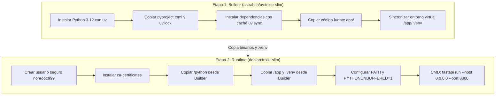

# 🐳 Generación de Imágenes Docker - Backend (MACTI-API)

> **Tecnología**: Docker (Multi-stage Build) | **Base**: Debian Trixie-Slim | **Gestor de Entorno**: Astral `uv` | **Servidor**: FastAPI CLI / Uvicorn

---

## 1. 📌 Visión General

La generación de imágenes Docker para el backend (**MACTI-API**) implementa una estrategia de **compilación en múltiples etapas (Multi-stage Build)**. Esta arquitectura está optimizada para reducir el tamaño final de la imagen, separar las herramientas de construcción y compilación del entorno de ejecución final, y garantizar altos estándares de seguridad y rendimiento en entornos de producción.

---

## 🏗️ 2. Arquitectura del Dockerfile Multi-Stage

El proceso de construcción consta de **2 etapas principales**:



---

## 📋 3. Desglose de Etapas

### Etapa 1: Builder (`builder`)
- **Imagen Base**: `ghcr.io/astral-sh/uv:trixie-slim`
- **Propósito**: Descargar la versión oficial de Python `3.12`, resolver e instalar todas las dependencias declaradas en `pyproject.toml` y `uv.lock`.
- **Optimizaciones Aplicadas**:
  - `UV_COMPILE_BYTECODE=1`: Compila código Python a `.pyc` durante la instalación para acelerar el arranque del contenedor.
  - `UV_LINK_MODE=copy`: Forzado de copia de archivos en lugar de enlaces simbólicos.
  - `UV_NO_DEV=1`: Excluye dependencias de desarrollo (`dev`).
  - **Cache Mounts** (`--mount=type=cache,target=/root/.cache/uv`): Reutilización de la caché del paquete `uv` en compilaciones sucesivas.
  - **Separación de capas**: Se ejecutan las dependencias primero sin el código fuente (`uv sync --locked --no-install-project`) para maximizar el uso de caché de Docker cuando solo cambia el código fuente.

### Etapa 2: Runtime de Producción (`runner`)
- **Imagen Base**: `debian:trixie-slim` (imagen ligera sin herramientas de construcción ni compiladores).
- **Seguridad**:
  - Creación de usuario y grupo de sistema sin privilegios `nonroot` (UID `999`, GID `999`).
  - El contenedor se ejecuta bajo `USER nonroot`.
- **Certificados SSL**: Instalación de `ca-certificates` para permitir conexiones salientes HTTPS seguras (Keycloak, Moodle, APIs externas).
- **Copia de Artefactos**: Se copia exclusivamente la carpeta `/python` y el directorio `/app` con la carpeta `.venv` generada.
- **Variables de Entorno**:
  - `PATH="/app/.venv/bin:$PATH"`
  - `PYTHONPATH="/app"`
  - `PYTHONUNBUFFERED=1` (garantiza la emisión instantánea de logs estructurados sin almacenamiento en buffer).
- **Puerto Expuesto**: `8000`.
- **Comando de Inicio**: `fastapi run --host 0.0.0.0 --port 8000`.

---

## ⚠️ 4. Advertencia de Seguridad: Variables Privadas y Secretos

> [!CAUTION]
> **NUNCA Incluir Variables Privadas en el Dockerfile**:
> Jamás debes declarar ni escribir variables de entorno privadas, contraseñas, credenciales de base de datos, llaves secretas o tokens de API (`POSTGRES_PASSWORD`, `REDIS_PASSWORD`, `SECRET_KEY`, etc.) directamente dentro del [Dockerfile](file:///f:/dev/web/macti-monorepo/backend/Dockerfile).
>
> **Riesgo de Seguridad**:
> Cualquier valor declarado en instrucciones `ENV` o `ARG` dentro del Dockerfile queda grabado permanentemente en las capas de la imagen compilada y puede ser inspeccionado fácilmente por cualquier persona o sistema con acceso a la imagen o al registro de contenedores (GHCR). Todas las configuraciones sensibles del backend deben inyectarse exclusivamente en **tiempo de ejecución (runtime)** mediante el orquestador (Kubernetes Secrets, Docker Compose o archivos `.env` no versionados).


---

## 🚀 5. Instrucciones de Construcción y Ejecución Local

### 5.1 Construir la Imagen Docker
Desde la raíz de la carpeta [backend](file:///f:/dev/web/macti-monorepo/backend):

```bash
docker build -t macti-backend:latest -f Dockerfile .
```

### 5.2 Ejecutar el Contenedor
```bash
docker run -d \
  --name macti-backend-app \
  -p 8000:8000 \
  --env-file .env \
  macti-backend:latest
```

---

## 🔄 6. Pipeline CI/CD (GitHub Actions)

La construcción de la imagen del backend está automatizada mediante el flujo de trabajo [.github/workflows/backend-ci-cd.yml](file:///f:/dev/web/macti-monorepo/.github/workflows/backend-ci-cd.yml):
1. **Detección de Cambios**: Se dispara únicamente si existen cambios dentro de `backend/` o en el archivo de workflow.
2. **Control de Calidad**: Validación previa de código (Ruff / Pyright).
3. **Construcción y Registro**:
   - Usa `docker/buildx-action` y `docker/build-push-action`.
   - Se publica automáticamente en GitHub Container Registry (`ghcr.io`).
   - Etiquetas generadas dinámicamente por rama, pull request y resumen del commit (`sha`).
