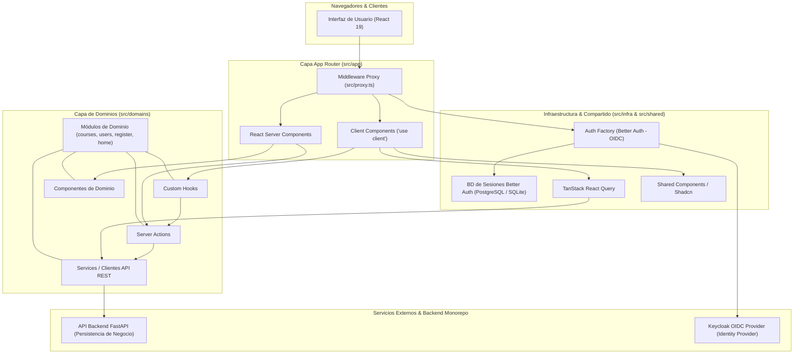
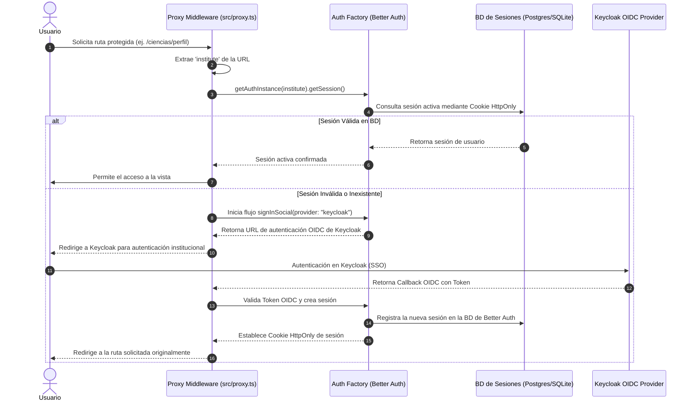

# 🏛️ Arquitectura del Frontend - MACTI
 
> **Framework**: Next.js 16 (App Router) | **React**: 19 | **Estilos**: Tailwind CSS 4 | **Lenguaje**: TypeScript 6

---

## 1. 📌 Introducción y Visión General

El frontend de la plataforma **MACTI** está diseñado como un **dashboard centralizado**, moderno y escalable con soporte **multitenant** para distintas instituciones y facultades educativas. Su objetivo principal es concentrar en una sola interfaz la administración de usuarios, la gestión integral de cursos, los flujos operativos de aprendizaje y el acceso a materiales didácticos en Moodle.

La arquitectura sigue los principios de **Domain-Driven Design (DDD)** modularizado, separación clara de responsabilidades por capas (Presentación, Dominio, Infraestructura y Compartido), y un modelo híbrido de renderizado (Server Components + Client Components) provisto por Next.js App Router.

> [!IMPORTANT]
> **Persistencia y Autenticación en el Frontend**:
> 1. **Cero Persistencia de Negocio**: El frontend **no almacena ni persiste datos de lógica de negocio** (cursos, contenidos, calificaciones, etc.). Toda la información de negocio reside y se gestiona en Moodle o en la API Backend.
> 2. **Base de Datos Exclusiva para Sesiones**: La base de datos configurada en `infra/db` (SQLite local en desarrollo o PostgreSQL en producción) es empleada **exclusivamente por Better Auth para almacenar las sesiones de usuario**.
> 3. **Autenticación Exclusiva OIDC / Keycloak**: El usuario **nunca realiza inicio de sesión con contraseña en el frontend**. La autenticación se delega al 100% a Keycloak mediante protocolo OIDC (OpenID Connect) por instituto.

---

## 🛠️ 2. Stack Tecnológico

| Capa / Dominio | Tecnología / Herramienta | Versión Principal | Descripción |
|---|---|---|---|
| **Framework Base** | Next.js (App Router) | `16` | Enrutamiento basado en archivos, Server Components (RSC) y Server Actions. |
| **Librería UI** | React | `19` | Renderizado declarativo con las últimas capacidades de React 19. |
| **Lenguaje** | TypeScript | `6` | Tipado estricto en toda la base de código. |
| **Estilos CSS** | Tailwind CSS + tw-animate | `4` | Estilos utilitarios Mobile-First y variables CSS modernas. |
| **Primitivos UI** | Radix UI / Shadcn UI | `1` | Componentes accesibles (a11y) desacoplados y personalizables. |
| **Estado Servidor / Caché** | TanStack React Query | `5` | Gestión de caché de peticiones a la API REST e invalidación síncrona. |
| **Estado Cliente** | Zustand | `5` | Estado global liviano para la interfaz de usuario. |
| **Autenticación** | Better Auth | `1` | Gestión de sesiones y cookies seguras mediante **exclusivamente OIDC con Keycloak** (sin contraseña). |
| **Persistencia de Sesiones** | Better SQLite3 / PostgreSQL (pg) | `12` / `8` | **Exclusivo para guardar sesiones de Better Auth** (`infra/db`). El frontend no almacena datos de negocio. |
| **Validación de Esquemas** | Zod | `4` | Validación de datos e insumos en cliente y servidor. |
| **Calidad & Formateo** | Biome | `2` | Linter y formateador estricto (reemplazo ultrarrápido de ESLint/Prettier). |
| **Gestor de Paquetes** | pnpm | - | Gestor de dependencias mandatorio en el monorrepositorio. |

---

## 🏗️ 3. Estructura de Directorios (`src/`)

El código fuente dentro de `src/` está organizado en 4 capas principales más los interceptores globales:

```
src/
├── app/                   # Capa de Enrutamiento y Páginas (Next.js App Router)
│   ├── [institute]/       # Rutas dinámicas multitenant por instituto/facultad
│   │   ├── [courseId]/    # Rutas dinámicas por curso (ej. solicitudes, catálogo)
│   │   └── perfil/        # Gestión del perfil de usuario por instituto
│   ├── api/               # API Routes internas de Next.js
│   ├── registro/          # Flujo global de registro de nuevos usuarios
│   ├── globals.css        # Estilos globales, tipografías y configuración de Tailwind CSS v4
│   ├── layout.tsx         # Layout raíz de la aplicación (fuentes Google, metadata)
│   └── page.tsx           # Landing page / Selector inicial de instituto
│
├── domains/               # Capa de Dominio (Domain-Driven Design)
│   ├── courses/           # Dominio de gestión de cursos y materiales
│   ├── register/          # Dominio del flujo de registro e inscripción
│   ├── users/             # Dominio de usuarios, roles y perfiles
│   └── home/              # Dominio de la vista principal e inicio
│       ├── actions/       # Server Actions / Handlers de mutación de Next.js
│       ├── components/    # Componentes de UI exclusivos del dominio
│       ├── hooks/         # Custom Hooks del dominio
│       ├── schemas/       # Esquemas de validación Zod
│       └── services/      # Clientes API para consumir el Backend (FastAPI)
│
├── infra/                 # Capa de Infraestructura y Adaptadores
│   ├── auth/              # Fábrica y cliente de autenticación OIDC (Better Auth + Keycloak)
│   │   ├── auth.ts        # Configuración principal de Better Auth
│   │   ├── auth-client.ts # Cliente de autenticación para Client Components
│   │   ├── auth-factory.ts# Fábrica multitenant OIDC por instituto
│   │   └── auth-session.ts# Manejo de tokens y cookies de sesión
│   └── db/                # Fábrica de persistencia EXCLUSIVA para sesiones de Better Auth
│       ├── db-factory.ts  # Selector de driver de sesión (SQLite / Postgres)
│       ├── postgres/      # Cliente PostgreSQL para BD de sesiones
│       └── sqlite/        # Cliente SQLite para BD de sesiones
│
├── shared/                # Capa de Recursos Compartidos
│   ├── components/        # Componentes UI reutilizables de alto nivel
│   ├── shadcn/            # Primitivos atómicos de Shadcn/Radix UI
│   ├── providers/         # Proveedores globales de contexto (QueryClientProvider, etc.)
│   ├── config/            # Configuraciones y constantes globales del cliente
│   └── utils/             # Funciones auxiliares puras (formateadores, clasificadores)
│
├── assets/                # Recursos estáticos locales (imágenes, logos institucionales)
└── proxy.ts               # Interceptor y middleware de autenticación OIDC/multitenant
```

---

## 🧩 4. Capas de la Arquitectura y Responsabilidades



### 4.1 Capa App Router (`src/app`)
* **Propósito**: Maneja el enrutamiento declarativo basado en el sistema de archivos de Next.js.
* **Componentes de Servidor (RSC)**: Se utilizan por defecto para el renderizado inicial rápido, SEO optimizado y la carga inicial de datos desde el servidor sin enviar JavaScript innecesario al cliente.
* **Multitenancy**: La estructura `/[institute]` permite aislar la navegación y contexto de cada instituto (ej. `/unam-ciencias`, `/fi`).

### 4.2 Capa de Dominios (`src/domains`)
* **Propósito**: Encapsula la lógica de negocio modularizada según la metodología DDD.
* Cada dominio contiene:
  * **Server Actions**: Operaciones de servidor que procesan peticiones y coordinan llamadas a servicios.
  * **Custom Hooks**: Abstracciones de React para manejar lógica de estado e interacción en Client Components.
  * **Services / Clientes API**: Clientes que consumen los endpoints REST del backend en FastAPI.
  * **Componentes de Dominio**: Componentes visuales específicos de la lógica de negocio del módulo.
  * **Esquemas Zod**: Validaciones tipadas de entradas y formularios.

### 4.3 Capa de Infraestructura (`src/infra`)
* **Propósito**: Contiene las integraciones técnicas externas y la gestión de autenticación.
* **Módulo `infra/auth`**: Implementa la fábrica `auth-factory.ts` para generar instancias de Better Auth adaptadas al instituto actual (`getAuthInstance(institute)`), comunicándose exclusivamente con Keycloak mediante OIDC.
* **Módulo `infra/db`**: Fábrica `db-factory.ts` encargada **únicamente de conectar la base de datos de sesiones de Better Auth** (PostgreSQL o SQLite). No se almacena ninguna información de negocio en esta base de datos.

### 4.4 Capa Compartida (`src/shared`)
* **Propósito**: Código y componentes reutilizables sin estado de negocio específico.
* **Componentes Shadcn/Radix**: Primitivos accesibles (botones, modales, menús, etiquetas, formularios).
* **Proveedores (`providers/`)**: Configuración global de React Query Provider y otros proveedores de contexto.
* **Utilidades (`utils/`)**: Funciones helpers puras (ej. `cn()` para fusión de clases CSS, formateadores de fecha, etc.).

---

## 🔐 5. Flujos Arquitectónicos Clave

### 5.1 Flujo Multitenant y Autenticación OIDC (`proxy.ts` + Keycloak)

Toda autenticación de usuarios es delegada a Keycloak mediante **OIDC**; no existe formulario ni almacenamiento de contraseñas en el frontend.



### 5.2 Manejo de Estado y Datos de Negocio

> [!NOTE]
> El frontend es un cliente sin estado de persistencia de negocio. Toda la información persistente (cursos, usuarios, notas, entregas) se obtiene y se guarda mediante la API Backend FastAPI.

1. **Estado Servidor & Caché (TanStack React Query v5)**:
   - Gestiona el almacenamiento en caché cliente de las peticiones REST al Backend.
   - Sincroniza automáticamente datos en segundo plano, reintentos y revalidación de caché tras mutaciones.
2. **Estado de Interfaz de Usuario (Zustand)**:
   - Almacena exclusivamente el estado efímero de la UI en el cliente (modales, menús colapsables, filtros de vista visuales).
3. **Validación de Datos (Zod)**:
   - Garantiza la integridad de datos tipados en formularios antes de enviarse al Backend o a Server Actions.

---

## 🎨 6. Sistema de Estilos y UI

* **Tailwind CSS v4**: Configurado en `src/app/globals.css`, aprovechando las nuevas directivas CSS de Tailwind v4 y las fuentes Google (`Montserrat`, `Hind Madurai`, `Lora`) importadas de forma optimizada en `layout.tsx`.
* **Primitivos Radix UI + Shadcn**: Todos los componentes interactivos cumplen con el estándar **WCAG 2.1 AA** de accesibilidad (soporte nativo de teclado y atributos ARIA).
* **Fusión de Estilos**: Utiliza `clsx` y `tailwind-merge` mediante el helper `cn()` para la composición dinámica de clases sin conflictos.

---

## 🧹 7. Estándares de Calidad y Desarrollo

* **Linter & Formateador**: Se utiliza exclusivamente **Biome** (`pnpm lint`) para la verificación y corrección de estilo de código en `src/`.
* **Documentación en Código**: Componentes, Server Actions, utilidades y servicios de dominio deben incluir comentarios **JSDoc**.
* **Gestión de Paquetes**: Uso obligatorio de `pnpm` (`pnpm add`, `pnpm dev`, `pnpm build`).
* **Commits**: Convención de **Conventional Commits** en español y en tiempo pasado (ej. `feat(courses): agrego filtro de búsqueda en catalogo`).

---

## 📝 8. Documentación Relacionada

* 📋 [Requerimientos Frontend](./requerimientos-frontend.md): Especificación de requerimientos funcionales y no funcionales.
* 📚 [README Frontend](../README.md): Guía de instalación, configuración y ejecución del proyecto.
* 🤖 [Reglas del Agente Frontend](../.agents/AGENTS.md): Directivas de desarrollo para asistentes y colaboradores.
* 🌐 [Guía de Creación de Servicios y Validaciones](./guia-creacion-servicios.md): Patrones, uso de `processFetch`, Zod y consumo de APIs.
* 🧩 [Guía de Creación y Uso de Componentes](./guia-componentes-y-shadcn.md): Criterios de diseño, estructura de `src/shared/components` e integración con Shadcn UI.
* 🛠️ [Guía de Utilidades Compartidas](./utils.md): Referencia rápida sobre `tryCatch` y `processFetch`.
* 🕒 [Autenticación y Base de Datos de Sesiones](./autenticacion-y-base-de-datos.md): Configuración y manejo de autenticación y persistencia de sesiones.
* 🌐 [Variables de Entorno](./variables-entorno.md): Catálogo exhaustivo, ciclo de vida (build vs runtime) y configuración por entornos.
