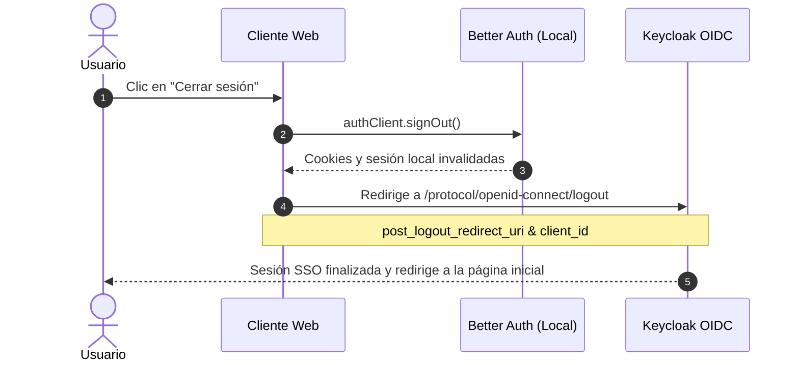

# 🔐 Autenticación e Infraestructura de Base de Datos - MACTI Frontend

> **Librería de Autenticación**: Better Auth | **Proveedor de Identidad**: Keycloak (OIDC) | **Bases de Datos de Sesión**: SQLite / PostgreSQL

---

## 1. 📌 Introducción y Visión General

La capa de autenticación y persistencia del frontend de MACTI se encuentra centralizada en [`src/infra`](../src/infra). Su propósito exclusivo es **gestionar la sesión de los usuarios y abstraer la identidad federada**, siguiendo los siguientes principios clave:

1. **Cero persistencia de negocio**: La base de datos del frontend **no almacena cursos, materias ni calificaciones**. Su único propósito es persistir tokens, sesiones activas y cuentas federadas administradas por **Better Auth**.
2. **Autenticación delegada 100% a Keycloak (OIDC)**: Los usuarios no crean cuentas locales ni usan contraseñas en el frontend. La autenticación se realiza exclusivamente mediante Keycloak a través del protocolo OpenID Connect (OIDC).
3. **Multi-Tenancy por Instituto**: MACTI atiende a múltiples facultades e institutos universitarios (`principal`, `ciencias`, `ingenieria`, etc.). Cada instituto posee su propio *Realm* o cliente OIDC en Keycloak y sus cookies de sesión aisladas.
4. **Patrón Backend for Frontend (BFF)**: Las credenciales y access tokens de APIs de backend nunca se exponen al cliente JavaScript en el navegador; todo se maneja a través de cookies seguras y un proxy interno.

---

## 🏗️ 2. Estructura de Archivos (`src/infra`)

```
src/infra/
├── auth/
│   ├── auth.ts              # Instancia estática base requerida por el CLI de Better Auth
│   ├── auth-factory.ts      # Factoría de instancias de Better Auth por instituto (Server-Side)
│   ├── auth-client.ts       # Factoría y caché de clientes Better Auth (Client-Side / React)
│   └── auth-session.ts      # Utilidades de sesión y cierre federado (Federated Logout)
└── db/
    ├── db-factory.ts        # Factoría de conexiones según DATABASE_PROVIDER (sqlite | postgres)
    ├── postgres/
    │   ├── postgres.ts      # Pool de conexión a PostgreSQL (driver pg)
    │   └── migrations/
    │       └── schema.sql   # Esquema SQL para PostgreSQL
    └── sqlite/
        ├── sqlite.ts        # Conexión local a SQLite (driver better-sqlite3)
        └── migrations/
            └── *.sql        # Esquema SQL para SQLite
```

---

## 🛠️ 3. Múltiples Opciones de BD para DX (Developer Experience)

Para optimizar la experiencia de desarrollo local sin sacrificar la robustez en producción, el sistema implementa una factoría de conexiones en [`db-factory.ts`](../src/infra/db/db-factory.ts).

### Comparativa de Proveedores

| Proveedor | Driver | Entorno Sugerido | Características y DX |
|---|---|---|---|
| **`sqlite`** | `better-sqlite3` | **Desarrollo Local** | **DX inmediata**: No requiere instalar Docker, ni levantar contenedores de PostgreSQL, ni configurar puertos de red. La base de datos se inicializa en un archivo local (`auth.sqlite`). |
| **`postgres`** | `pg` (`Pool`) | **Staging / Producción / Kubernetes** | Soporta pooling de conexiones concurrentes, aislamiento transaccional robusto y persistencia distribuida en clúster. |

### Implementación del Factory de BD

```typescript
// src/infra/db/db-factory.ts
import { initPostgres } from "./postgres/postgres";
import { initSQLite } from "./sqlite/sqlite";

const mapDb = {
  sqlite: initSQLite,
  postgres: initPostgres,
};

type DbProvider = keyof typeof mapDb;

export const getDbInstance = (dbProvider: string | null = null) => {
  const DATABASE_PROVIDER =
    (dbProvider as DbProvider) || (process.env.DATABASE_PROVIDER as DbProvider);

  if (!DATABASE_PROVIDER || !(DATABASE_PROVIDER in mapDb)) {
    throw new Error(
      `Solo se admiten los siguientes proveedores de base de datos: ${Object.keys(mapDb).join(", ")}. Proveedor recibido: ${DATABASE_PROVIDER}`
    );
  }

  const initDb = mapDb[DATABASE_PROVIDER];
  return initDb();
};
```

### 🛡️ Desacoplamiento de Base de Datos en Build-Time con `NEXT_PHASE`

Durante la compilación (`pnpm build` o en el Dockerfile), Next.js App Router realiza un análisis estático de dependencias e importa los módulos de servidor (incluyendo [`auth-factory.ts`](../src/infra/auth/auth-factory.ts) y [`auth-client.ts`](../src/infra/auth/auth-client.ts)).

Si durante el build `getAuthInstance(institute)` intentara conectarse a la base de datos (PostgreSQL), la compilación fallaría inmediatamente, pues la base de datos no está activa dentro del contenedor de compilación de Docker.

Para resolver esto de forma limpia y tipada, el código evalúa la variable interna de Next.js:

```typescript
import { PHASE_PRODUCTION_BUILD } from "next/constants";

const isBuildPhase = process.env.NEXT_PHASE === PHASE_PRODUCTION_BUILD;

export const getAuthInstance = (
  institute: InstitutesType,
  dbProvider: string | null = null,
  baseUrl: string | null = null,
) => {
  // Durante la fase de build, devolvemos una instancia genérica sin conexión a BD
  if (isBuildPhase) {
    return genericAuthInstance;
  }
  // En tiempo de ejecución (runtime), inicializa Better Auth con la BD real
  // ...
};
```

**Beneficios arquitectónicos**:
1. **Compilación Hermética**: El build de Next.js concluye exitosamente sin requerir conectividad de red a PostgreSQL ni variables de producción activas.
2. **Aislamiento de Entorno**: Better Auth exporta los tipos y definiciones necesarias para Next.js sin ejecutar side-effects de base de datos en tiempo de construcción.

---

## 🗄️ 4. Modelos de Datos y Migraciones

Better Auth gestiona 4 tablas relacionales indispensables para el ciclo de vida de la autenticación:

```
┌──────────────┐         1:N         ┌─────────────────┐
│     user     │ ──────────────────< │     session     │
│──────────────│                     │─────────────────│
│ id (PK)      │                     │ id (PK)         │
│ name         │                     │ token (Unique)  │
│ email (UQ)   │                     │ expiresAt       │
│ image        │                     │ userId (FK)     │
└──────────────┘                     └─────────────────┘
       │
       │ 1:N
       ▼
┌──────────────────────┐             ┌─────────────────┐
│       account        │             │  verification   │
│──────────────────────│             │─────────────────│
│ id (PK)              │             │ id (PK)         │
│ providerId (keycloak)│             │ identifier      │
│ accountId            │             │ value           │
│ accessToken          │             │ expiresAt       │
│ refreshToken         │             └─────────────────┘
│ userId (FK)          │
└──────────────────────┘
```

### Detalle de las Tablas

1. **`user`**: Perfil básico del usuario autenticado (ID, nombre, correo, imagen).
2. **`session`**: Almacena el token de sesión emitido por Better Auth, su expiración y la relación con el usuario (`userId`). Posee borrado en cascada.
3. **`account`**: Guarda la vinculación federada con Keycloak (`providerId = "keycloak"`), junto con los tokens OIDC (`accessToken`, `refreshToken`, `idToken`) y sus tiempos de expiración.
4. **`verification`**: Tokens temporales y control de estados OAuth contra ataques de falsificación (State/Nonce).

### Rol de `src/infra/auth/auth.ts`

El CLI de Better Auth (`@better-auth/cli`) inspecciona por convención un módulo exportado como `auth` para inferir el esquema de plugins y tablas.

El archivo [`auth.ts`](../src/infra/auth/auth.ts) existe **única y exclusivamente para permitir las tareas del CLI de Better Auth**.

> [!WARNING]
> **Nunca utilices `auth` directamente en la lógica de la aplicación.** Para el código en ejecución (runtime), usa siempre `getAuthInstance(institute)`.

### Comandos de Migración

```bash
# Generar archivos de migración SQL basados en la configuración
pnpm dlx @better-auth/cli generate --config ./src/infra/auth/auth.ts

# Aplicar las migraciones directamente en la base de datos configurada
pnpm dlx @better-auth/cli migrate --config ./src/infra/auth/auth.ts
```

---

## 🛡️ 5. Razones de Uso y Seguridad con Cookies (Patrón BFF)

La arquitectura de MACTI protege las credenciales de los usuarios mitigando los vectores de ataque más comunes en aplicaciones web modernas:

### A. HttpOnly Cookies vs LocalStorage
- **Riesgo de LocalStorage**: Guardar tokens JWT en `localStorage` o `sessionStorage` permite que cualquier script malicioso inyectado vía **XSS (Cross-Site Scripting)** robe los tokens del usuario con `window.localStorage.getItem(...)`.
- **Protección con Cookies**: Better Auth (mediante el plugin `nextCookies()`) almacena los identificadores de sesión en cookies marcadas como `HttpOnly`, `SameSite: Lax` y `Secure`. El código JavaScript en el navegador **no tiene acceso a la cookie**, neutralizando el robo de sesión por XSS.

### B. Aislamiento Multi-Tenant con `cookiePrefix`
Al desplegar múltiples facultades bajo el mismo dominio base, una cookie genérica (`session_token`) provocaría colisión de sesiones al navegar entre facultades.
En [`auth-factory.ts`](../src/infra/auth/auth-factory.ts):

```typescript
advanced: {
  cookiePrefix: `auth-${institute}`,
}
```
Esto genera cookies independientes por instituto (ej. `auth-ciencias.session_token`, `auth-ingenieria.session_token`), garantizando sesiones paralelas y aisladas.

### C. Ocultamiento de Tokens hacia APIs Externas (Reverse Proxy)
En [`src/app/api/proxy/[institute]/[[...path]]/route.ts`](../src/app/api/proxy/[institute]/[[...path]]/route.ts):
1. El cliente envía su petición al proxy con su cookie de sesión HttpOnly.
2. El servidor Next.js valida la sesión con `auth.api.getSession()`.
3. El servidor extrae el `accessToken` de Keycloak de la base de datos con `auth.api.getAccessToken({ providerId: "keycloak" })`.
4. El servidor inyecta el encabezado `Authorization: Bearer <token>` de forma segura en la petición hacia `K8S_API_URL`.
5. **El navegador del usuario nunca conoce ni almacena el token Bearer.**

### D. Ventana de Inactividad y Rolling Session
```typescript
session: {
  // Coincide con la ventana de inactividad configurada en Keycloak
  expiresIn: 24 * 60 * 60, // 24 horas
  // Refresca la sesión periódicamente mientras el usuario esté activo
  updateAge: 15 * 60,      // 15 minutos
}
```

### E. Importancia Crítica de `BETTER_AUTH_SECRET` en Producción y Clústeres Multi-Pod

Better Auth utiliza la variable de entorno `BETTER_AUTH_SECRET` como **llave simétrica de cifrado y firma criptográfica** para asegurar los identificadores de sesión y las cookies `HttpOnly` emitidas al navegador.

> [!CAUTION]
> **Riesgo Crítico en Despliegues de Producción y Kubernetes**:
> Si `BETTER_AUTH_SECRET` no se define de forma explícita en el archivo de secretos (`Secret` de Kubernetes):
> 1. **Generación Aleatoria en Memoria**: Better Auth generará una clave aleatoria efímera en la memoria RAM del proceso al iniciar el servidor Node.js.
> 2. **Falla en Clústeres con Múltiples Réplicas (Multi-Pod)**: Cada réplica del Pod tendrá una clave distinta. Si una petición del usuario es balanceada hacia el Pod A, este emitirá una cookie cifrada con la clave A. Cuando la siguiente petición del usuario sea atendida por el Pod B, este **no podrá descifrar la cookie** y rechazará la sesión, desconectando al usuario aleatoriamente.
> 3. **Pérdida Total de Sesiones tras Reinicio o Rollout**: Cada vez que se despliegue una nueva versión de la imagen Docker o Kubernetes reinicie un Pod, la clave cambiará y **todos los usuarios activos perderán su sesión de inmediato**.

**Recomendación de Generación**:
En producción, `BETTER_AUTH_SECRET` debe ser una cadena aleatoria de alta entropía (mínimo 32 caracteres) inyectada en el `Secret` de Kubernetes compartida por todas las réplicas:
```bash
# Generar una clave secreta segura de 32 bytes en Base64
openssl rand -base64 32
```

---

## 🔑 6. OIDC con Keycloak

Cada instituto educativo tiene sus propios parámetros en [`src/shared/config/kcConfig.ts`](../src/shared/config/kcConfig.ts):

```typescript
export const keycloakConfigs: Record<InstitutesType, KeycloakConfig> = {
  ciencias: {
    clientId: process.env.NEXT_PUBLIC_KEYCLOAK_CLIENT_ID || "",
    clientSecret: process.env.CIENCIAS_KEYCLOAK_CLIENT_SECRET || "",
    issuer: process.env.NEXT_PUBLIC_CIENCIAS_KEYCLOAK_ISSUER || "",
  },
  // ... resto de institutos
};
```

### Configuración en `auth-factory.ts`

```typescript
plugins: [
  genericOAuth({
    config: [
      keycloak({
        clientId: keycloakConfig?.clientId ?? "",
        clientSecret: keycloakConfig?.clientSecret ?? "",
        issuer: keycloakConfig?.issuer ?? "",
      }),
    ],
  }),
  nextCookies(),
]
```

### Cierre de Sesión Federado (Federated Logout)

Cerrar sesión localmente en Better Auth no basta: si la sesión en Keycloak sigue abierta, el Single Sign-On (SSO) volvería a autenticar al usuario automáticamente.

La función `signOutFederatedSession` en [`auth-session.ts`](../src/infra/auth/auth-session.ts) ejecuta el flujo completo:



---

## 💻 7. Guía de Uso y Ejemplos Prácticos

### A. En Server Components (RSC) y Server Actions
Para verificar sesión o leer datos del usuario en el servidor:

```typescript
import { headers } from "next/headers";
import { getAuthInstance } from "@/infra/auth/auth-factory";
import type { InstitutesType } from "@/shared/config/institutes";

export async function UserProfileServer({ institute }: { institute: InstitutesType }) {
  const auth = getAuthInstance(institute);
  const session = await auth.api.getSession({
    headers: await headers(),
  });

  if (!session) {
    return <p>No autenticado</p>;
  }

  return (
    <div>
      <p>Hola, {session.user.name}</p>
      <p>Correo: {session.user.email}</p>
    </div>
  );
}
```

### B. En Client Components (React / `useSession`)
Para consultar el estado de la sesión en el navegador:

```tsx
"use client";

import { getAuthClient } from "@/infra/auth/auth-client";
import type { InstitutesType } from "@/shared/config/institutes";

export function SessionBadge({ institute }: { institute: InstitutesType }) {
  const authClient = getAuthClient(institute);
  const { data: session, isPending } = authClient.useSession();

  if (isPending) return <span>Cargando...</span>;
  if (!session) return <span>No autenticado</span>;

  return <span>Usuario: {session.user.name}</span>;
}
```

### C. Botón de Inicio de Sesión
```tsx
"use client";

import { getAuthClient } from "@/infra/auth/auth-client";

export function LoginButton({ institute }: { institute: string }) {
  const handleLogin = async () => {
    const authClient = getAuthClient(institute);
    await authClient.signIn.social({
      provider: "keycloak",
      callbackURL: `/${institute}/perfil`,
    });
  };

  return <button onClick={handleLogin}>Iniciar sesión</button>;
}
```

### D. Botón de Cierre de Sesión Federado
```tsx
"use client";

import { signOutFederatedSession } from "@/infra/auth/auth-session";
import type { InstitutesType } from "@/shared/config/institutes";

export function LogoutButton({ institute }: { institute: InstitutesType }) {
  const handleLogout = async () => {
    await signOutFederatedSession({
      institute,
      redirectPath: `/${institute}`,
    });
  };

  return <button onClick={handleLogout}>Cerrar sesión</button>;
}
```

---

## ⚙️ 8. Variables de Entorno Relevantes

| Variable | Descripción | Ejemplo |
|---|---|---|
| `DATABASE_PROVIDER` | Proveedor activo de base de datos (`sqlite` o `postgres`). | `sqlite` |
| `DATABASE_URL` | Ruta del archivo SQLite o cadena de conexión PostgreSQL. | `./data/auth.sqlite` |
| `NEXT_PUBLIC_APP_URL` | URL base pública de la aplicación Next.js. | `http://localhost:3000` |
| `K8S_API_URL` | URL del backend REST en Kubernetes al que se hace proxy. | `http://localhost:8000` |
| `NEXT_PUBLIC_KEYCLOAK_CLIENT_ID` | Identificador de cliente público en Keycloak. | `local-next-login` |
| `NEXT_PUBLIC_<INSTITUTO>_KEYCLOAK_ISSUER` | URL del issuer / realm de Keycloak por instituto. | `https://auth.macti.unam.mx/realms/ciencias` |
| `<INSTITUTO>_KEYCLOAK_CLIENT_SECRET` | Secreto del cliente Keycloak por instituto. | `secret-del-realm` |

> [!TIP]
> Para consultar el catálogo completo, ciclo de vida (build-time vs. runtime) y plantillas `.env.local` y Kubernetes para estas variables, consulta la guía maestra de [Variables de Entorno](./variables-entorno.md).

---

## 🔗 9. Documentación Relacionada

* 🌐 [Variables de Entorno](./variables-entorno.md): Catálogo completo, variables OIDC multitenant y persistencia de sesiones.
* 🏛️ [Arquitectura del Frontend](./arquitectura-frontend.md): Organización general en capas DDD e infraestructura.
* 🛡️ [Middleware Proxy (`proxy.ts`)](./proxy.md): Interceptor de rutas privadas y negociación de sesiones OIDC.
* 🔄 [Pipeline de CI/CD](./cicd-pipeline.md): Compilación standalone y despliegue en Kubernetes.
