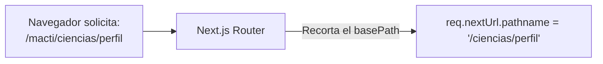

# 🛣️ Guía de Enrutamiento con Base Path (`NEXT_PUBLIC_BASE_PATH`)

> **Framework**: Next.js 16 (App Router) | **Prefijo Global**: `/macti` | **Infraestructura**: Kubernetes Ingress / Nginx Reverse Proxy

---

## 📑 Tabla de Contenidos

1. [Introducción y Propósito de `basePath`](#1-📌-introducción-y-propósito-de-basepath)
2. [Configuración Central (`next.config.ts`)](#2-⚙️-configuración-central-nextconfigts)
3. [El "Gotcha" Crítico de Next.js: `nextUrl.pathname`](#3-⚠️-el-gotcha-crítico-de-nextjs-nexturlpathname)
4. [Impacto en Autenticación OIDC y Redirecciones](#4-🔐-impacto-en-autenticación-oidc-y-redirecciones)
5. [Componente `<Link>` vs. Redirecciones Nativas (`window.location`)](#5-🧭-componente-link-vs-redirecciones-nativas-windowlocation)
6. [Consumo en Servicios del Cliente y Proxy](#6-🌐-consumo-en-servicios-del-cliente-y-proxy)
7. [Buenas Prácticas y Reglas Mandatorias](#7-🛡️-buenas-prácticas-y-reglas-mandatorias)
8. [Documentación Relacionada](#8-🔗-documentación-relacionada)

---

## 1. 📌 Introducción y Propósito de `basePath`

En entornos de producción institucionales (UNAM), la plataforma **MACTI** no se despliega en la raíz de un dominio dedicado (`https://ejemplo.com/`), sino como una subaplicación alojada bajo un prefijo o subdirectorio compartido:

$$\text{URL Pública:} \quad \mathbf{https://tlapoa.lamod.unam.mx/macti}$$

Para que Next.js sea consciente de que debe servir todos los activos estáticos (`/_next/...`), páginas y rutas API debajo de este prefijo sin requerir que los desarrolladores reestructuren la carpeta `src/app/`, se utiliza la funcionalidad nativa de **`basePath`** gobernada por la variable de entorno:

```bash
NEXT_PUBLIC_BASE_PATH=/macti
```

---

## 2. ⚙️ Configuración Central (`next.config.ts`)

La configuración se inicializa en [`next.config.ts`](../next.config.ts):

```typescript
import type { NextConfig } from "next";

const nextConfig: NextConfig = {
  // Define el subdirectorio de montaje de la aplicación
  basePath: process.env.NEXT_PUBLIC_BASE_PATH ?? "/",
  output: "standalone",
};

export default nextConfig;
```

> [!IMPORTANT]
> **Convención de Formato**:
> En Next.js, `basePath` debe comenzar obligatoriamente con una diagonal `/` y **no debe terminar con diagonal**. Por ejemplo: `/macti` (correcto) vs `/macti/` (inválido). Si la app se sirve en la raíz, se omite o se pasa cadena vacía `""`.

---

## 3. ⚠️ El "Gotcha" Crítico de Next.js: `nextUrl.pathname`

Uno de los comportamientos más importantes y propensos a confusión en Next.js App Router es cómo se maneja la URL dentro del objeto `NextRequest` en el middleware ([`src/proxy.ts`](../src/proxy.ts)) y en los Route Handlers:



* **El Problema**: Next.js **remueve automáticamente el `basePath`** al poblar la propiedad `req.nextUrl.pathname`.
* **La Trampa**: Si en tu código necesitas construir una URL externa o un retorno de autenticación (callback) y utilizas únicamente `req.nextUrl.pathname`, **el prefijo `/macti` se perderá**, generando un error 404 en el Ingress/Nginx al volver del proveedor de identidad.

---

## 4. 🔐 Impacto en Autenticación OIDC y Redirecciones

### 4.1 En el Middleware (`src/proxy.ts`)
Cuando un usuario no autenticado intenta acceder a una ruta protegida (ej. `/macti/ciencias/perfil`), el proxy inicia el flujo de login delegando a Keycloak:

```typescript
// src/proxy.ts
async function handleBetterAuthLogin(request: NextRequest, auth: AuthInstance) {
  const basePath = process.env.NEXT_PUBLIC_BASE_PATH ?? "";
  
  // 🚨 CRÍTICO: Re-adjuntar manualmente el basePath al callbackURL
  const callbackURL = `${basePath}${request.nextUrl.pathname}${request.nextUrl.search}`;

  const result = await auth.api.signInSocial({
    body: {
      provider: "keycloak",
      disableRedirect: true,
      callbackURL: callbackURL, // -> /macti/ciencias/perfil
    },
    headers: await headers(),
  });

  return result;
}
```

Si no se concatenara `${basePath}`, Keycloak retornaría al usuario a `/ciencias/perfil`, donde el Ingress de Kubernetes no encontraría la aplicación frontend.

### 4.2 En el Cierre de Sesión Federado (`auth-session.ts`)
En [`src/infra/auth/auth-session.ts`](../src/infra/auth/auth-session.ts), al salir de Keycloak, el parámetro `post_logout_redirect_uri` debe dirigir al inicio del tenant:

```typescript
const basePath = process.env.NEXT_PUBLIC_BASE_PATH ?? "";
redirectPath = redirectPath ?? `${basePath}/${institute}`;

logoutUrl.searchParams.set(
  "post_logout_redirect_uri",
  `${window.location.origin}${redirectPath}`, // https://tlapoa.lamod.unam.mx/macti/ciencias
);
```

---

## 5. 🧭 Componente `<Link>` vs. Redirecciones Nativas (`window.location`)

Existe una diferencia fundamental en cómo reacciona el cliente según el método de navegación:

| Método de Navegación | ¿Next.js añade `basePath` automáticamente? | Ejemplo Correcto |
|---|---|---|
| Componente `<Link>` de Next.js | **SÍ (Automático)** | `<Link href="/ciencias/perfil">Ir al perfil</Link>`<br>*(Next.js renderiza `<a href="/macti/ciencias/perfil">`)* |
| `router.push(...)` de `next/navigation` | **SÍ (Automático)** | `router.push("/ciencias/cursos")` |
| `window.location.assign(...)` o `window.location.href` | **NO (Manual)** | `window.location.assign(`${basePath}/ciencias`)` |
| Etiquetas nativas `<a href="...">` | **NO (Manual)** | `<a href={`${basePath}/ciencias`}>...</a>` |

> [!CAUTION]
> **Anti-Patrón de Duplicación**:
> Si pasas el `basePath` al componente `<Link href={`${basePath}/ciencias`}>`, Next.js lo volverá a añadir, generando una URL inválida: `/macti/macti/ciencias`. Usa siempre rutas relativas a la app con `<Link>`.

---

## 6. 🌐 Consumo en Servicios del Cliente y Proxy

Cuando el navegador ejecuta peticiones asíncronas con `fetch` hacia las API Routes del BFF, no se encuentra bajo el contexto del enrutador de Next.js, por lo que **sí se requiere el prefijo `basePath`**:

```typescript
// Ejemplo en src/domains/users/services/updateAccountStatus.ts
const basePath = process.env.NEXT_PUBLIC_BASE_PATH ?? "";

const peticion = fetch(`${basePath}/api/proxy/${institute}/users/${userId}/status`, {
  method: "PATCH",
  headers: { "Content-Type": "application/json" },
  body: JSON.stringify(data),
});
```

---

## 7. 🛡️ Buenas Prácticas y Reglas Mandatorias

1. **Uso de Fallback Seguro**: Siempre consume la variable con `process.env.NEXT_PUBLIC_BASE_PATH ?? ""` para que en entornos locales donde `basePath` no esté definido o sea raíz, la concatenación no produzca `undefined`.
2. **Incrustación en Dockerfile**: Dado que tiene el prefijo `NEXT_PUBLIC_`, **debe declararse en la etapa `builder` del Dockerfile** (`ENV NEXT_PUBLIC_BASE_PATH=/macti`). Modificarla en runtime vía ConfigMap no afectará a los componentes de cliente.
3. **Consistencia con `NEXT_PUBLIC_APP_URL`**: `NEXT_PUBLIC_APP_URL` debe coincidir en su sufijo con `NEXT_PUBLIC_BASE_PATH` (ej. `NEXT_PUBLIC_APP_URL=https://tlapoa.lamod.unam.mx/macti`).

---

## 8. 🔗 Documentación Relacionada

* 🌐 [Variables de Entorno](./variables-entorno.md): Catálogo completo y ciclo de vida de variables.
* 🛡️ [Middleware Proxy (`proxy.ts`)](./proxy.md): Interceptor de sesiones y construcción de callbacks.
* 🔐 [Autenticación OIDC y Base de Datos](./autenticacion-y-base-de-datos.md): Flujo federado de login y logout.
* 🐳 [Generación de Imágenes Docker](./generacion-imagenes.md): Inyección de variables públicas en build-time.
