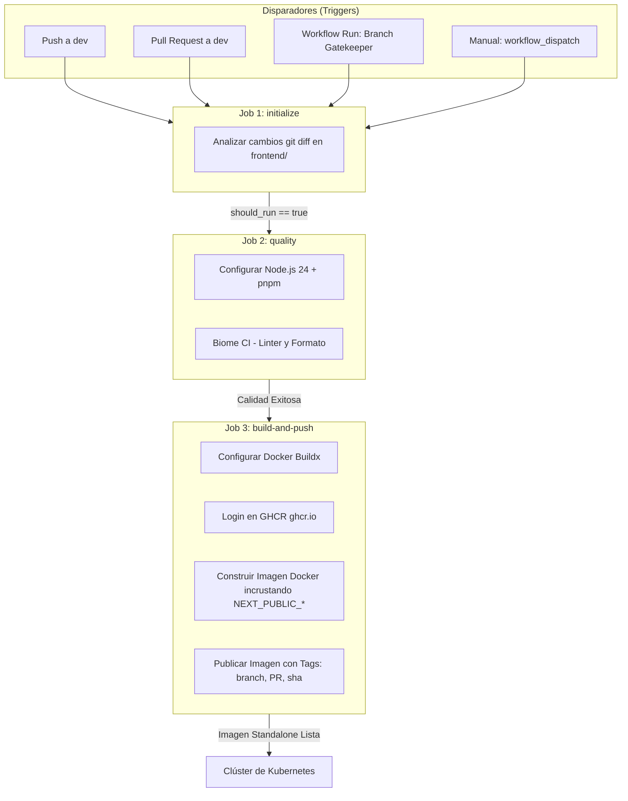
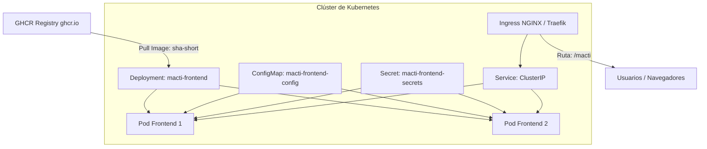

# 🔄 Pipeline de CI/CD y Despliegue en Kubernetes - Frontend (MACTI)

> **Flujo de CI/CD**: GitHub Actions ([.github/workflows/frontend-ci-cd.yml](file:///f:/dev/web/macti-monorepo/.github/workflows/frontend-ci-cd.yml)) | **Registry**: GHCR (`ghcr.io`) | **Entorno de Despliegue**: Kubernetes (K8s)

---

## 1. 📌 Visión General

El pipeline de CI/CD para la aplicación web frontend (**MACTI**) automatiza la inspección de código mediante linter y formateador (**Biome**), la compilación optimizada en modo `standalone` con **Next.js 16**, el empaquetado de la imagen Docker en **GitHub Container Registry (GHCR)** y su integración con un clúster de **Kubernetes (K8s)** para despliegues a producción.

---

## 🚀 2. Flujo del Pipeline CI/CD (GitHub Actions)

El flujo de trabajo está definido en [.github/workflows/frontend-ci-cd.yml](file:///f:/dev/web/macti-monorepo/.github/workflows/frontend-ci-cd.yml) y consta de 3 trabajos (*jobs*) encadenados:



### 📋 Detalle de Jobs

#### 1. `initialize` (Detección de Cambios)
- Examina las modificaciones mediante `git diff`.
- Retorna `should_run=true` si se detectan cambios en [frontend/](file:///f:/dev/web/macti-monorepo/frontend) o en el archivo de workflow del frontend.

#### 2. `quality` (Control de Calidad con Biome)
- Inicializa Node.js 24 y `pnpm v10`.
- Ejecuta `pnpm exec biome ci ./src` para validar reglas estrictas de linter y formateador de código TypeScript/React.

#### 3. `build-and-push` (Compilación Standalone y Registro de Imagen)
- Autenticación en `ghcr.io`.
- Inyección de variables estáticas `NEXT_PUBLIC_*` en el [Dockerfile](file:///f:/dev/web/macti-monorepo/frontend/Dockerfile) durante el proceso de compilación (`builder` stage).
- Etiquetado de imagen:
  - `sha-<commit_short>`: Tag inmutable para producción.
  - `<nombre-rama>`: Tag dinámico por rama.

---

## ⚠️ 3. Consideración Crítica para Despliegues en Kubernetes: Variables `NEXT_PUBLIC_*`

> [!IMPORTANT]
> **Diferencia entre Variables de Compilación (Build-Time) y Variables de Servidor (Runtime)**:
> - **Variables de Cliente (`NEXT_PUBLIC_*`)**: Se compilan e incrustan dentro del bundle JS estático durante el paso `build-and-push` del pipeline de CI/CD. **No pueden modificarse mediante ConfigMaps en Kubernetes**. Si se requieren cambios en URLs públicas (ej. `NEXT_PUBLIC_APP_URL`), se debe reconstruir la imagen Docker en el CI/CD.
> - **Variables de Servidor / Runtime**: Variables consumidas exclusivamente por el servidor Node.js en Server Components o API Routes (ej. `K8S_API_URL`, `BETTER_AUTH_SECRET`, cadenas de conexión a base de datos de sesiones en `infra/db`) **sí se inyectan a través de ConfigMaps y Secrets de Kubernetes**.

---

## ☸️ 4. Integración y Despliegue en Kubernetes (Producción)

En Kubernetes, el frontend se despliega como un servidor **Node.js Standalone** altamente eficiente, escuchando en el puerto `3000`.



### 4.1 Componentes de Kubernetes para el Frontend

#### A. Deployment (`macti-frontend-deployment.yaml`)
- **Etiqueta de Imagen**: Usar el tag `sha-<short>` generado por GitHub Actions (`ghcr.io/<username>/macti-v3-frontend:<TAG>`).
- **Seguridad (`securityContext`)**:
  - `runAsUser: 1000` (usuario `node` sin privilegios de root configurado en el Dockerfile).
- **Probes de Salud**:
  - `livenessProbe`: `HTTP GET /macti` en el puerto `3000`.
  - `readinessProbe`: `HTTP GET /macti` comprobando la disponibilidad antes de dirigir tráfico de usuarios.

#### B. ConfigMap (`macti-frontend-config.yaml`)
Configuración de runtime para peticiones servidor a servidor (Server Side Rendering / Server Actions):
```yaml
apiVersion: v1
kind: ConfigMap
metadata:
  name: macti-frontend-config
data:
  NODE_ENV: "production"
  PORT: "3000"
  HOSTNAME: "0.0.0.0"
  K8S_API_URL: "http://macti-backend-service.macti.svc.cluster.local:8000"
```

#### C. Secret (`macti-frontend-secrets.yaml`)
Variables confidenciales requeridas por el servidor (ej. Better Auth):
```yaml
apiVersion: v1
kind: Secret
metadata:
  name: macti-frontend-secrets
type: Opaque
stringData:
  BETTER_AUTH_SECRET: "<SECRET_KEY_BETTER_AUTH>"
  SESSION_DB_URL: "postgresql://auth_user:<PASSWORD>@postgres-service:5432/auth_db"
```

#### D. Ingress & Service
- **Service**: Tipo `ClusterIP` expuesto en el puerto `3000`.
- **Ingress**: Mapea el prefijo base `/macti` hacia el servicio del frontend.

---

## 🛠️ 5. Comandos de Actualización y Rollback en Producción

### 5.1 Despliegue de Nueva Versión
```bash
# Aplicar la nueva versión generada por el CI/CD en el clúster
kubectl set image deployment/macti-frontend-deployment \
  macti-frontend=ghcr.io/<username>/macti-v3-frontend:<TAG> \
  -n macti-prod

# Validar el estado del despliegue progresivo
kubectl rollout status deployment/macti-frontend-deployment -n macti-prod
```

### 5.2 Cancelación / Rollback
Si se detecta alguna anomalía tras la actualización:
```bash
kubectl rollout undo deployment/macti-frontend-deployment -n macti-prod
```
