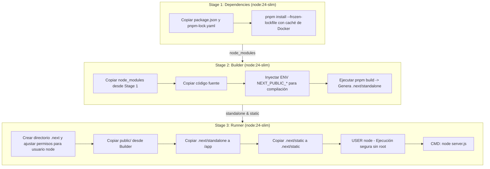

# 🐳 Generación de Imágenes Docker - Frontend (MACTI)

> **Framework**: Next.js 16 (App Router) | **Modo**: Standalone Output | **Runtime**: Node.js 24-slim | **Gestor de Paquetes**: pnpm

---

## 1. 📌 Visión General

La generación de la imagen Docker del frontend (**MACTI**) utiliza una estrategia de **construcción multi-etapa (Multi-Stage Build)** optimizada para aplicaciones Next.js en producción mediante el modo **`standalone`**.

Esta arquitectura permite empaquetar únicamente el código servidor minimizado y las dependencias estrictamente necesarias obtenidas a través de *output file tracing*, reduciendo drásticamente el tamaño final del contenedor y el tiempo de arranque.

---

## ⚠️ 2. REGLA MANDATORIA: Variables Públicas en el Dockerfile (`NEXT_PUBLIC_*`)

> [!CAUTION]
> **Incrustación en Tiempo de Compilación (Build Time)**:
> En Next.js, **todas las variables de entorno que comienzan con el prefijo `NEXT_PUBLIC_` son inyectadas e incrustadas directamente en los paquetes JavaScript estáticos del cliente en el momento exacto en que se ejecuta `pnpm build`**.
>
> **Implicación Crítica**:
> Configurar variables `NEXT_PUBLIC_*` en el archivo de despliegue en tiempo de ejecución (runtime / contenedor en ejecución) **NO tendrá ningún efecto en el código ejecutado en el navegador del usuario**, ya que los scripts `.js` fueron compilados previamente en el build stage.

### 📍 Ubicación Mandatoria
Por esta razón, las variables públicas **deben escribirse directamente en el [Dockerfile](file:///f:/dev/web/macti-monorepo/frontend/Dockerfile)** (o declararse como `ENV` en la etapa de compilación) dentro de la etapa **`builder`** antes de ejecutar la instrucción `pnpm build`:

```dockerfile
# ============================================
# Stage 2: Build Next.js application in standalone mode
# ============================================
FROM node:${NODE_VERSION} AS builder

    WORKDIR /app
    COPY --from=dependencies /app/node_modules ./node_modules
    COPY . .

    ENV NEXT_TELEMETRY_DISABLED=1
    ENV NODE_ENV=production

    # 🚨 VARIABLES PÚBLICAS REQUERIDAS DURANTE LA COMPILACIÓN 🚨
    ENV NEXT_PUBLIC_BASE_PATH=/macti
    ENV NEXT_PUBLIC_APP_URL=https://tlapoa.lamod.unam.mx/macti
    ENV NEXT_PUBLIC_API_URL=/macti-api
    ENV NEXT_PUBLIC_KEYCLOAK_CLIENT_ID=next-login
    ENV NEXT_PUBLIC_PRINCIPAL_KEYCLOAK_ISSUER=https://sso.lamod.unam.mx/auth/realms/macti3dev
    ENV K8S_API_URL=https://tlapoa.lamod.unam.mx/macti-api

    RUN corepack enable pnpm && pnpm build;
```

---

## 🏗️ 3. Arquitectura del Dockerfile Multi-Stage

El proceso de construcción consta de **3 etapas principales**:



---

## 📋 4. Desglose de Etapas

### Stage 1: `dependencies`
- **Base**: `node:24.17.0-slim`
- **Propósito**: Instalar las dependencias de `pnpm` utilizando congelamiento de versiones (`--frozen-lockfile`).
- **Optimización**: Utiliza `--mount=type=cache,target=/root/.local/share/pnpm/store` para reutilizar el almacenamiento virtual de `pnpm` en construcciones subsecuentes.

### Stage 2: `builder`
- **Base**: `node:24.17.0-slim`
- **Propósito**: Ejecutar la compilación optimizada de Next.js (`pnpm build`).
- **Puntos Clave**:
  - Inyección explícita de `NEXT_PUBLIC_*` requeridas por el compilador en esta etapa.
  - Generación de artefactos standalone en `.next/standalone` y archivos estáticos en `.next/static`.
  - Deshabilitación de telemetría de Next.js (`NEXT_TELEMETRY_DISABLED=1`).

### Stage 3: `runner` (Entorno de Producción)
- **Base**: `node:24.17.0-slim`
- **Propósito**: Servidor de producción en ejecución ligera.
- **Seguridad**: Se ejecuta bajo el usuario del sistema no privilegiado `USER node`.
- **Estructura copiada**:
  - `public/`: Imágenes y activos estáticos del cliente.
  - `.next/standalone`: Servidor HTTP minimalista en Node.js auto-contenido.
  - `.next/static`: Chunks de código JS y CSS optimizados.
- **Puerto Expuesto**: `3000`.
- **Comando de Inicio**: `node server.js`.

---

## 🚀 5. Instrucciones de Construcción y Ejecución Local

### 5.1 Construir la Imagen Docker
Desde la raíz de la carpeta [frontend](file:///f:/dev/web/macti-monorepo/frontend):

```bash
docker build -t macti-frontend:latest -f Dockerfile .
```

### 5.2 Ejecutar el Contenedor
```bash
docker run -d \
  --name macti-frontend-app \
  -p 3000:3000 \
  macti-frontend:latest
```

---

## 🔄 6. Pipeline CI/CD (GitHub Actions)

La construcción de la imagen del frontend está automatizada en [.github/workflows/frontend-ci-cd.yml](file:///f:/dev/web/macti-monorepo/.github/workflows/frontend-ci-cd.yml):
1. **Filtro de Ejecución**: Se ejecuta en `push`/`pull_request` sobre `dev` cuando hay cambios en la carpeta `frontend/`.
2. **Validación de Calidad**: Verificación estricta de linter y formateador con Biome (`pnpm exec biome ci ./src`).
3. **Build & Push**: Construcción de la imagen multi-etapa y publicación automatizada en GitHub Container Registry (`ghcr.io`).
