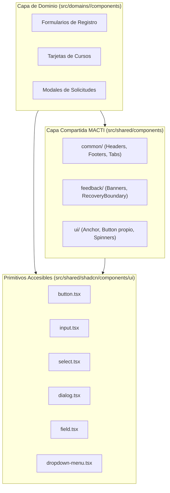
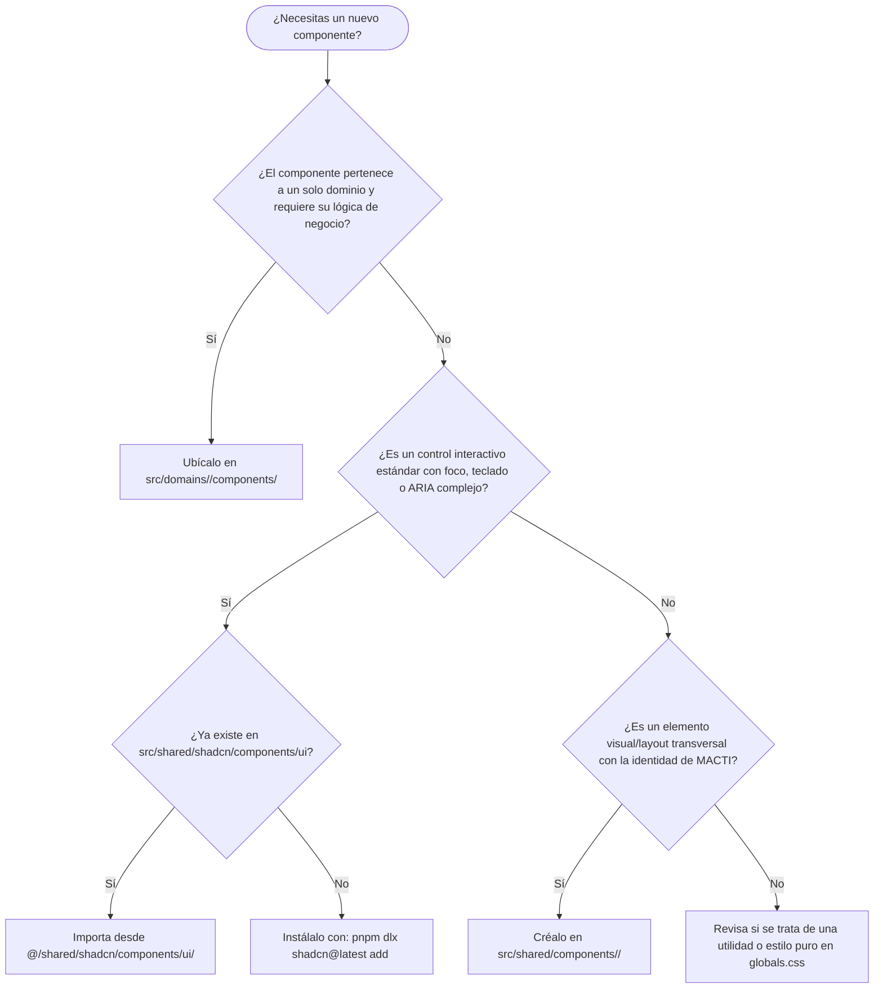

# 🧩 Guía de Creación y Uso de Componentes UI

> Guía técnica y de arquitectura para la estructuración de componentes en `src/shared/components`, la integración con componentes primitivos y accesibles de Shadcn UI en `src/shared/shadcn`, y los criterios de decisión para el diseño de interfaces en MACTI.

---

## 📑 Tabla de Contenidos

1. [Introducción y Filosofía de Diseño](#1-📌-introducción-y-filosofía-de-diseño)
2. [Criterios de Selección: ¿Cuándo crear vs. cuándo usar Shadcn?](#2-🎯-criterios-de-selección-cuándo-crear-vs-cuándo-usar-shadcn)
3. [Árbol de Decisión: Dónde Ubicar un Componente](#3-🗺️-árbol-de-decisión-dónde-ubicar-un-componente)
4. [Estructura y Organización de `src/shared/components`](#4-📂-estructura-y-organización-de-srcsharedcomponents)
   - [Subdirectorio `common/`](#subdirectorio-common)
   - [Subdirectorio `feedback/`](#subdirectorio-feedback)
   - [Subdirectorio `ui/`](#subdirectorio-ui)
   - [Estándares de Codificación y JSDoc](#estándares-de-codificación-y-jsdoc)
5. [Ruta, Configuración e Integración de `src/shared/shadcn`](#5-⚙️-ruta-configuración-e-integración-de-srcsharedshadcn)
   - [Análisis de `components.json`](#análisis-de-componentsjson)
   - [Integración con Tailwind CSS v4 (`globals.css`)](#integración-con-tailwind-css-v4-globalscss)
   - [Función de utilidad `cn(...)` y alias de importación](#función-de-utilidad-cn-y-alias-de-importación)
6. [Flujo de Trabajo: Añadir Componentes con Shadcn CLI](#6-🛠️-flujo-de-trabajo-añadir-componentes-con-shadcn-cli)
7. [Ejemplos de Implementación y Casos de Uso](#7-🔍-ejemplos-de-implementación-y-casos-de-uso)
   - [Ejemplo 1: Componente propio compartido (`src/shared/components/ui/`)](#ejemplo-1-componente-propio-compartido-srcsharedcomponentsui)
   - [Ejemplo 2: Formulario accesible con Shadcn en una vista de dominio](#ejemplo-2-formulario-accesible-con-shadcn-en-una-vista-de-dominio)
   - [Ejemplo 3: Composición híbrida (Componente propio consumiendo Shadcn)](#ejemplo-3-composición-híbrida-componente-propio-consumiendo-shadcn)
8. [Buenas Prácticas y Anti-Patrones](#8-⚖️-buenas-prácticas-y-anti-patrones)

---

## 1. 📌 Introducción y Filosofía de Diseño

El frontend de **MACTI** maneja una interfaz moderna, multitenant y con alto grado de consistencia visual institucional (UNAM y facultades asociadas). Para mantener un código escalable, mantenible y libre de duplicidad técnica, la arquitectura UI divide los componentes en tres niveles:

1. **Primitivos UI y Accesibilidad (`src/shared/shadcn/`)**: Componentes base de diseño atómico creados con Radix UI y Tailwind CSS.
2. **Componentes Compartidos de Negocio/Marca (`src/shared/components/`)**: Componentes de layout, navegación y elementos visuales reutilizables con la identidad gráfica propia de MACTI.
3. **Componentes de Dominio (`src/domains/<dominio>/components/`)**: Vistas y controles específicos de flujos concretos (ej. catálogo de cursos, administración de solicitudes, registro de usuarios).



---

## 2. 🎯 Criterios de Selección: ¿Cuándo crear vs. cuándo usar Shadcn?

Para decidir entre crear un nuevo componente o utilizar/extender uno de Shadcn, se siguen dos directrices fundamentales:

### 🟢 Crear nuevos componentes en `src/shared/components`
Se crean componentes propios cuando:
- **Identidad y Comportamiento de MACTI**: Es necesario o más sencillo reflejar la identidad visual, tipográfica o de marca de la plataforma (ej. headers con soporte multitenant institucional, logotipos SVG dinámicos, pie de página institucional con sellos de la UNAM).
- **Componentes de Composición Global**: Se requiere coordinar layout y autenticación a nivel transversal (ej. `Header.tsx` verificando la sesión con Better Auth y mostrando variantes autenticadas/no autenticadas).
- **Mecanismos de Resiliencia Propios**: Herramientas globales de la aplicación como `RuntimeRecoveryBoundary.tsx` para interceptar errores de fragmentos dinámicos en producción.

### 🔵 Usar componentes de Shadcn en `src/shared/shadcn`
Se utilizan componentes de Shadcn cuando:
- **No reinventar la rueda**: El elemento a construir es un patrón de interfaz estándar de la industria (botones, campos de texto, selectores, checkboxes, menús flotantes, avatares, diálogos).
- **Garantizar Accesibilidad Universal (A11y)**: Se requiere cumplimiento riguroso con los estándares **WCAG 2.1 AA**, navegación íntegra por teclado (`Tab`, `Escape`, `Enter`, flechas de cursor), captura correcta del foco (*focus traps*) y gestión de atributos ARIA (`aria-expanded`, `aria-invalid`, `aria-haspopup`).
- **Comportamientos de Alto Esfuerzo**: El componente involucra animaciones complejas, cálculo dinámico de posición (*floating-ui*), detección de clics fuera de zona (*click-outside*), o composición de formularios multielemento (`Field`, `FieldLabel`, `FieldError`, `Select`, `Dialog`).

---

## 3. 🗺️ Árbol de Decisión: Dónde Ubicar un Componente

Utiliza el siguiente diagrama de flujo cuando vayas a crear o modificar un componente en el frontend:



---

## 4. 📂 Estructura y Organización de `src/shared/components`

El directorio [`src/shared/components/`](../src/shared/components) alberga todos los componentes reutilizables que representan la experiencia global de usuario de MACTI. Se organiza en tres subcarpetas especializadas:

```
src/shared/components/
├── common/             # Layouts globales, cabeceras y pie de página
│   ├── Header.tsx                 # Cabecera principal (Server Component con sesión OIDC)
│   ├── HeaderBasic.tsx            # Cabecera simplificada para landing/registro público
│   ├── AutenticatedHeader.tsx     # Menú de usuario autenticado con dropdown y avatar
│   ├── UnauthenticatedHeader.tsx   # Menú para usuarios anónimos con botón de login
│   ├── ProfileTabs.tsx            # Pestañas de navegación de perfil
│   └── Footer.tsx                 # Pie de página con logotipos institucionales UNAM
│
├── feedback/           # Retroalimentación, alertas y control de errores
│   ├── Banner.tsx                 # Banners informativos y de advertencia/error
│   └── RuntimeRecoveryBoundary.tsx# Boundary para auto-recuperar caídas de chunks en cliente
│
└── ui/                 # Elementos visuales propios de MACTI
    ├── Button.tsx                 # Botón personalizado con variantes corporativas y spinner
    ├── Anchor.tsx                 # Enlaces estilizados con soporte de rutas internas/externas
    ├── LoginButton.tsx            # Botón de inicio de sesión OIDC con redirección institucional
    └── Spinner.tsx                # Indicador de carga animado SVG
```

### Subdirectorio `common/`
- **Propósito**: Alojar componentes estructurales presentes en la mayoría de las páginas de la aplicación.
- **Responsabilidad**:
  - `Header.tsx`: Actúa como Server Component, consulta la sesión actual mediante `getAuthInstance(institute).api.getSession()` y conmuta limpiamente entre `AutenticatedHeader` y `UnauthenticatedHeader`.
  - `Footer.tsx`: Provee el pie de página institucional responsive, organizando los sellos de Ciencias, Geofísica y Ciencias Nucleares de la UNAM.
  - `ProfileTabs.tsx`: Renderiza pestañas de navegación contextual para el panel de usuario.

### Subdirectorio `feedback/`
- **Propósito**: Comunicar estados del sistema, confirmaciones, advertencias y recuperación de fallas de ejecución.
- **Responsabilidad**:
  - `Banner.tsx`: Presenta notificaciones de alerta con estados visuales claros (éxito, advertencia o error) y roles semánticos (`role="alert"`).
  - `RuntimeRecoveryBoundary.tsx`: Captura excepciones de hidratación y fallas de descarga de módulos JS (`ChunkLoadError`), implementando reintentos transparentes con recarga controlada antes de mostrar una pantalla de error.

### Subdirectorio `ui/`
- **Propósito**: Controles de presentación específicos que reflejan las variantes de color y tipografía de MACTI.
- **Responsabilidad**:
  - `Button.tsx`: Botón con variantes de color institucional (`recommended`, `danger`, `default`) y soporte nativo de indicador de carga (`isLoading`).
  - `Anchor.tsx`: Envoltorio estilizado alrededor de `next/link` que gestiona enlaces internos o externos (`target="_blank"`).
  - `LoginButton.tsx`: Desencadena el flujo OIDC institucional contra Keycloak utilizando la instancia de Better Auth.

### Estándares de Codificación y JSDoc

Al crear o editar cualquier componente en `src/shared/components`:
1. **Nombres de archivo y componentes**: Siempre en **PascalCase** (ej. `CourseCard.tsx`, `HeaderBasic.tsx`).
2. **TypeScript Estricto**: Todo componente debe declarar una interfaz explícita para sus `Props`.
3. **Mobile First con Tailwind CSS**: Los estilos deben iniciar por pantallas pequeñas y escalar progresivamente con prefijos de breakpoint (`md:`, `lg:`, `xl:`).
4. **Documentación JSDoc Obligatoria**: Debe incluirse un bloque JSDoc describiendo la responsabilidad del componente y el significado de sus propiedades.

```tsx
/**
 * Propiedades del componente CustomBadge.
 */
interface CustomBadgeProps {
  /** Texto a mostrar dentro del badge. */
  label: string;
  /** Variante visual de color. Por defecto: "info". */
  variant?: "info" | "success" | "warning";
}

/**
 * Indicador visual compacto para resaltar estados breves en la interfaz.
 */
export function CustomBadge({ label, variant = "info" }: CustomBadgeProps) {
  // Implementación...
}
```

---

## 5. ⚙️ Ruta, Configuración e Integración de `src/shared/shadcn`

Shadcn UI en este proyecto no se utiliza como una biblioteca tradicional externa en `node_modules`, sino mediante **código fuente copiado y mantenido directamente** dentro de `src/shared/shadcn/`. Esto otorga control total sobre cada línea de código y permite su adaptación al tema institucional.

### Análisis de `components.json`

El archivo de configuración raíz [`components.json`](../components.json) gobierna cómo opera la herramienta de línea de comandos de Shadcn en el proyecto:

```json
{
  "$schema": "https://ui.shadcn.com/schema.json",
  "style": "new-york",
  "rsc": true,
  "tsx": true,
  "tailwind": {
    "config": "",
    "css": "src/app/globals.css",
    "baseColor": "neutral",
    "cssVariables": true,
    "prefix": ""
  },
  "iconLibrary": "lucide",
  "aliases": {
    "components": "@/shared/shadcn/components",
    "utils": "@/shared/shadcn/lib/utils",
    "ui": "@/shared/shadcn/components/ui",
    "lib": "@/shared/shadcn/lib",
    "hooks": "@/shared/shadcn/hooks"
  },
  "registries": {}
}
```

#### Desglose de Propiedades Clave:
| Propiedad | Configuración | Impacto en el Proyecto |
|---|---|---|
| `style` | `"new-york"` | Aplica la variante visual moderna, con bordes definidos y tipografía compacta. |
| `rsc` | `true` | Compatible con React Server Components (Next.js 16 App Router). Añade `"use client"` únicamente a los componentes que interactúan con el DOM. |
| `tsx` | `true` | Los componentes generados son archivos TypeScript (`.tsx`). |
| `tailwind.css` | `"src/app/globals.css"` | Apunta al archivo global de estilos de Tailwind CSS v4. |
| `tailwind.cssVariables` | `true` | Genera clases que hacen referencia a tokens CSS dinámicos (modo claro/oscuro). |
| `iconLibrary` | `"lucide"` | Utiliza íconos de la biblioteca `lucide-react`. |
| `aliases` | Rutas personalizadas `@/shared/shadcn/...` | Garantiza que todos los componentes y utilitarios de Shadcn se instalen de forma ordenada dentro de `src/shared/shadcn/` sin contaminar `src/shared/components/`. |

### Integración con Tailwind CSS v4 (`globals.css`)

El proyecto utiliza **Tailwind CSS v4** mediante las directivas `@import "tailwindcss";` y `@theme inline`. En [`src/app/globals.css`](../src/app/globals.css) se definen los tokens que consumen los componentes de Shadcn:

```css
@theme inline {
  /* Variables de radio y elevación para Shadcn */
  --radius-sm: calc(var(--radius) - 4px);
  --radius-md: calc(var(--radius) - 2px);
  --radius-lg: var(--radius);

  /* Paleta semántica consumida por los primitivos */
  --color-background: var(--background);
  --color-foreground: var(--foreground);
  --color-primary: var(--primary);
  --color-primary-foreground: var(--primary-foreground);
  --color-secondary: var(--secondary);
  --color-secondary-foreground: var(--secondary-foreground);
  --color-destructive: var(--destructive);
  --color-border: var(--border);
  --color-ring: var(--ring);
}
```

### Función de utilidad `cn(...)` y alias de importación

Ubicación: [`src/shared/shadcn/lib/utils.ts`](../src/shared/shadcn/lib/utils.ts)

```ts
import { type ClassValue, clsx } from "clsx";
import { twMerge } from "tailwind-merge";

/**
 * Combina condicionalmente nombres de clases CSS y resuelve colisiones de Tailwind.
 */
export function cn(...inputs: ClassValue[]) {
  return twMerge(clsx(inputs));
}
```

- **`clsx`**: Evalúa expresiones condicionales (ej. `{ "opacity-50": disabled }`).
- **`twMerge`**: Resuelve sobreescrituras conflictivas de Tailwind CSS (por ejemplo, si pasas `px-4` y luego `px-6`, `twMerge` descarta `px-4` automáticamente).

#### Alias de Importación:
Siempre que consumas primitivos de Shadcn, utiliza el alias oficial configurado:
```tsx
// ✅ Correcto: Uso del alias configurado en components.json y tsconfig.json
import { Button } from "@/shared/shadcn/components/ui/button";
import { Input } from "@/shared/shadcn/components/ui/input";
import { cn } from "@/shared/shadcn/lib/utils";

// ❌ Incorrecto: No utilices rutas relativas complejas
import { Button } from "../../shared/shadcn/components/ui/button";
```

---

## 6. 🛠️ Flujo de Trabajo: Añadir Componentes con Shadcn CLI

> [!IMPORTANT]
> **Uso Mandatorio de `pnpm`**: Siguiendo las directivas de [.agents/AGENTS.md](../.agents/AGENTS.md), **nunca uses `npx` ni `npm`**. Todas las ejecuciones de herramientas CLI deben hacerse mediante `pnpm dlx`.

Para instalar un nuevo primitivo de Shadcn en el proyecto:

```bash
# Sintaxis general
pnpm dlx shadcn@latest add <nombre-componente>

# Ejemplos comunes
pnpm dlx shadcn@latest add dialog
pnpm dlx shadcn@latest add select
pnpm dlx shadcn@latest add dropdown-menu
pnpm dlx shadcn@latest add popover
```

### ¿Qué ocurre al ejecutar este comando?
1. El CLI lee [`components.json`](../components.json).
2. Descarga el código fuente del componente compatible con React 19 y Tailwind v4.
3. Lo guarda automáticamente en el directorio de destino configurado: `src/shared/shadcn/components/ui/<nombre-componente>.tsx`.
4. Si el componente requiere primitivos de Radix UI (como `@radix-ui/react-dialog`), el CLI los instala en `package.json` utilizando `pnpm`.

---

## 7. 🔍 Ejemplos de Implementación y Casos de Uso

### Ejemplo 1: Componente propio compartido (`src/shared/components/ui/`)

Creación de un botón interactivo o enlace con el estilo propio de MACTI:

```tsx
// src/shared/components/ui/Anchor.tsx
import Link from "next/link";
import type { ReactNode } from "react";

/**
 * Propiedades del componente Anchor.
 */
interface AnchorProps {
  /** Elementos o texto a mostrar dentro del enlace. */
  children: ReactNode;
  /** Ruta interna o externa de destino. */
  href: string;
  /** Clases CSS adicionales de Tailwind. */
  className?: string;
  /** Variante estética del enlace. */
  variant?: "default" | "secondary" | "bordered";
  /** Si es true, abre el enlace en una nueva pestaña. */
  external?: boolean;
}

const variants = {
  default: "bg-primary text-primary-foreground hover:bg-accent hover:text-accent-foreground",
  secondary: "bg-secondary text-secondary-foreground border border-gray-300 dark:border-gray-600 hover:bg-secondary/80",
  bordered: "bg-primary text-primary-foreground border-2 font-bold border-secondary hover:bg-accent hover:border-accent hover:text-accent-foreground",
};

/**
 * Enlace unificado para navegación interna y externa estilizado con Tailwind CSS.
 */
export function Anchor({
  children,
  href,
  className = "",
  variant = "default",
  external = false,
}: AnchorProps) {
  return (
    <Link
      href={href}
      target={external ? "_blank" : "_self"}
      rel={external ? "noopener noreferrer" : undefined}
      className={`flex justify-center items-center gap-2 p-2 rounded-lg transition-all duration-200 ${variants[variant]} ${className}`}
    >
      {children}
    </Link>
  );
}
```

### Ejemplo 2: Formulario accesible con Shadcn en una vista de dominio

Uso coordinado de componentes de formulario en [`src/domains/register/components/AccountRequestForm.tsx`](../src/domains/register/components/AccountRequestForm.tsx):

```tsx
"use client";

import Form from "next/form";
import { useActionState } from "react";
import { Button } from "@/shared/shadcn/components/ui/button";
import {
  Field,
  FieldDescription,
  FieldError,
  FieldGroup,
  FieldLabel,
  FieldSet,
} from "@/shared/shadcn/components/ui/field";
import { Input } from "@/shared/shadcn/components/ui/input";
import {
  Select,
  SelectContent,
  SelectItem,
  SelectTrigger,
  SelectValue,
} from "@/shared/shadcn/components/ui/select";
import { accountRequestAction } from "../actions/accountRequestAction";

/**
 * Formulario de solicitud de cuenta de estudiante integrando Shadcn UI y React 19.
 */
export default function AccountRequestForm({ institute }: { institute: string }) {
  const [state, formAction, isPending] = useActionState(accountRequestAction, null);

  return (
    <Form action={formAction} disabled={isPending} className="w-full max-w-lg space-y-6">
      <FieldSet>
        <FieldGroup>
          {/* Campo de Correo Electrónico */}
          <Field>
            <FieldLabel htmlFor="email">Correo Electrónico</FieldLabel>
            <Input
              id="email"
              name="email"
              type="email"
              placeholder="alumno@ciencias.unam.mx"
              required
            />
            <FieldDescription>
              Usa preferentemente tu correo institucional.
            </FieldDescription>
            {state?.errors?.email && (
              <FieldError>{state.errors.email[0]}</FieldError>
            )}
          </Field>

          {/* Campo de Selección */}
          <Field>
            <FieldLabel htmlFor="career">Carrera</FieldLabel>
            <Select name="career">
              <SelectTrigger id="career" className="w-full">
                <SelectValue placeholder="Selecciona tu carrera" />
              </SelectTrigger>
              <SelectContent>
                <SelectItem value="actuaria">Actuaría</SelectItem>
                <SelectItem value="ciencias-computacion">Ciencias de la Computación</SelectItem>
                <SelectItem value="fisica">Física</SelectItem>
                <SelectItem value="matematicas">Matemáticas</SelectItem>
              </SelectContent>
            </Select>
          </Field>
        </FieldGroup>
      </FieldSet>

      <Button type="submit" disabled={isPending} className="w-full">
        {isPending ? "Enviando..." : "Solicitar Cuenta"}
      </Button>
    </Form>
  );
}
```

### Ejemplo 3: Composición híbrida (Componente propio consumiendo Shadcn)

Uso del primitivo `Button` de Shadcn dentro de un componente de recuperación de fallas de MACTI:

```tsx
// src/shared/components/feedback/RuntimeRecoveryBoundary.tsx
"use client";

import { Component, type ReactNode } from "react";
import { Button } from "@/shared/shadcn/components/ui/button";

interface Props {
  children: ReactNode;
  fallback?: ReactNode;
}

interface State {
  hasError: boolean;
}

/**
 * Componente boundary que captura caídas de chunks y provee recarga manual accesible.
 */
export class RuntimeRecoveryBoundary extends Component<Props, State> {
  state: State = { hasError: false };

  static getDerivedStateFromError(): State {
    return { hasError: true };
  }

  private handleReload = () => {
    window.location.reload();
  };

  render() {
    if (this.state.hasError) {
      return (
        this.props.fallback || (
          <div className="flex min-h-screen items-center justify-center p-4">
            <div className="text-center space-y-4">
              <h2 className="text-xl font-bold">Error temporal al cargar la página</h2>
              <p className="text-muted-foreground text-sm">
                Hubo un inconveniente cargando los recursos. Puedes intentar recargar.
              </p>
              {/* Primitivo de Shadcn reutilizado en componente de feedback propio */}
              <Button type="button" onClick={this.handleReload}>
                Recargar ahora
              </Button>
            </div>
          </div>
        )
      );
    }

    return this.props.children;
  }
}
```

---

## 8. ⚖️ Buenas Prácticas y Anti-Patrones

### ✅ Prácticas Recomendadas (Do's)
1. **Verificar antes de construir**: Antes de crear un componente interactivo desde cero, consulta el catálogo de Shadcn (`pnpm dlx shadcn@latest add ...`).
2. **Respetar la semántica y accesibilidad**: Asegúrate de que los formularios utilicen etiquetas `<label>` vinculadas mediante `htmlFor` o los componentes `<FieldLabel>` de Shadcn.
3. **Composición con `cn()`**: Al aceptar `className` en tus componentes propios, fusiona las clases con `cn()` para permitir personalizaciones sin romper los estilos base.
4. **Mobile First riguroso**: Define estilos para dispositivos móviles primero y añade capas progresivas con `sm:`, `md:`, `lg:`.
5. **JSDoc en todo componente**: Documenta claramente el propósito del componente y sus propiedades.

### ❌ Prácticas Desaconsejadas (Don'ts)
1. **NO reinventar formularios ni selects nativos**: Evita crear selects o modales personalizados con `<div>` y `onClick` sin teclado ni accesibilidad; usa siempre los primitivos de `src/shared/shadcn/`.
2. **NO contaminar `src/shared/shadcn/` con lógica de negocio**: Los componentes dentro de `shadcn/components/ui` deben permanecer como primitivos agnósticos de datos de dominio.
3. **NO colocar componentes de dominio en `src/shared/`**: Si un componente solo se utiliza dentro del flujo de cursos o registro, debe residir en `src/domains/<dominio>/components/`.
4. **NO usar `npm` ni `yarn`**: El proyecto requiere estrictamente `pnpm` para la instalación de dependencias y ejecución de comandos.
5. **NO modificar las rutas de `components.json` de manera inconsistente**: Si modificas los alias en `components.json`, asegúrate de que coincidan con `paths` en `tsconfig.json`.

---

## 🔗 9. Documentación Relacionada

* 🌐 [Variables de Entorno](./variables-entorno.md): Consumo de `NEXT_PUBLIC_APP_URL` y `NEXT_PUBLIC_BASE_PATH` en componentes interactivos de autenticación y navegación.
* 🏛️ [Arquitectura del Frontend](./arquitectura-frontend.md): Organización general del código y capas de presentación.
* 🛠️ [Guía de Utilidades Compartidas (`tryCatch` y `processFetch`)](./utils.md): Manejo seguro de promesas en componentes y hooks.
* 📋 [Requerimientos Frontend](./requerimientos-frontend.md): Estándares de accesibilidad y diseño de interfaces.
