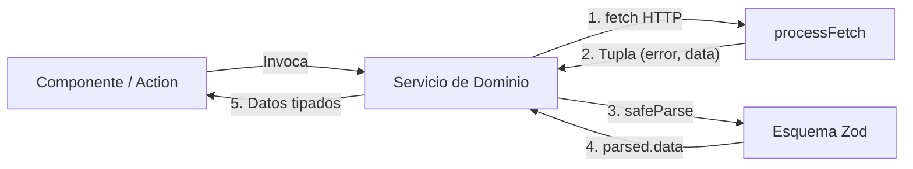
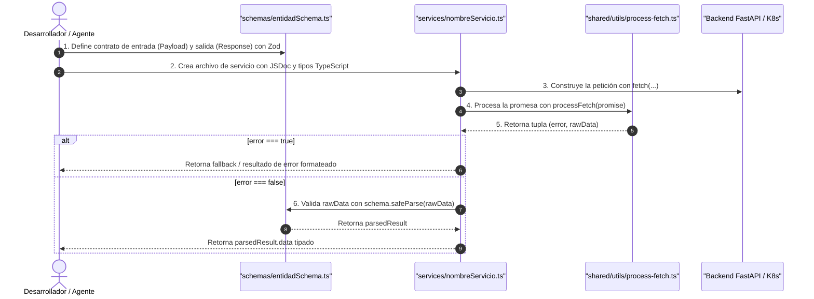

# 🌐 Guía para la Creación de Servicios y Validaciones

> Documentación de arquitectura y guía técnica paso a paso para la creación de servicios de consumo de API, uso de utilidades asíncronas (`processFetch`) e integración con validaciones de esquemas (Zod) en el frontend de MACTI.

---

## 📑 Tabla de Contenidos

1. [Introducción y Rol de los Servicios](#1-📌-introducción-y-rol-de-los-servicios)
2. [Estructura y Ubicación en la Arquitectura](#2-🏗️-estructura-y-ubicación-en-la-arquitectura)
3. [Tipos de Servicios: Servidor vs. Cliente / Proxy](#3-🔄-tipos-de-servicios-servidor-vs-cliente--proxy)
4. [Manejo de Peticiones: `processFetch`](#4-🛠️-manejo-de-peticiones-processfetch)
5. [Validación y Contratos con Zod](#5-🛡️-validación-y-contratos-con-zod)
6. [Flujo Paso a Paso para Crear un Servicio](#6-🚀-flujo-paso-a-paso-para-crear-un-servicio)
7. [Patrones de Retorno Estandarizados](#7-📦-patrones-de-retorno-estandarizados)
8. [Consumo de Servicios en las Capas de la App](#8-🔌-consumo-de-servicios-en-las-capas-de-la-app)
9. [Buenas Prácticas y Anti-Patrones](#9-⚖️-buenas-prácticas-y-anti-patrones)
10. [Ejemplos Completos de Referencia](#10-🔍-ejemplos-completos-de-referencia)

---

## 1. 📌 Introducción y Rol de los Servicios

En el frontend de MACTI, la interfaz **no almacena ni persiste datos de lógica de negocio** (cursos, matrículas, usuarios, solicitudes, etc.). Toda la persistencia y reglas de negocio residen en la API Backend (FastAPI / Moodle / Kubernetes).

Los **Servicios** (`services/`) son la capa encargada de:
1. **Aislar la comunicación HTTP**: Encapsular URLs, métodos, encabezados y serialización.
2. **Normalizar el manejo de errores**: Neutralizar fallas de red, caídas de deserialización y respuestas no-2xx sin arrojar excepciones no controladas.
3. **Garantizar contratos de datos**: Validar en tiempo de ejecución (runtime) que el backend retorne la estructura esperada antes de entregarla a los componentes o Server Actions mediante **Zod**.



---

## 2. 🏗️ Estructura y Ubicación en la Arquitectura

Cada módulo de dominio en `src/domains/<dominio>/` contiene sus propios servicios y esquemas asociados:

```
src/domains/<modulo>/
├── schemas/               # Contratos Zod (entrada y salida)
│   ├── miEntidadSchema.ts
│   └── index.ts
├── services/              # Clientes de consumo HTTP
│   ├── fetchMiEntidad.ts  # Servicio de lectura
│   └── createMiEntidad.ts # Servicio de mutación
├── actions/               # Server Actions que coordinan servicios
└── hooks/                 # Hooks de React Query que consumen servicios
```

### Reglas de Ubicación:
- **Servicios específicos de un dominio**: Deben ubicarse en `src/domains/<dominio>/services/`.
- **Esquemas y tipos del servicio**: Deben residir en `src/domains/<dominio>/schemas/`.
- **Utilidades compartidas de transporte**: Ubicadas en `src/shared/utils/` (`process-fetch.ts` y `try-catch.ts`).

---

## 3. 🔄 Tipos de Servicios: Servidor vs. Cliente / Proxy

En Next.js App Router coexisten dos escenarios de ejecución para los servicios:

| Característica | Servicios de Servidor (Server Services) | Servicios de Cliente / Proxy (Client Services) |
|---|---|---|
| **Entorno de ejecución** | Servidor (RSC, Server Actions, Route Handlers) | Cliente (Navegador, Custom Hooks, React Query) |
| **URL Base** | `process.env.K8S_API_URL` (red interna de clúster) | `${basePath}/api/proxy/[institute]/...` |
| **Autenticación** | Propagación explícita de cookies (`getCookieHeaders()`) | Automática mediante cookies HttpOnly del navegador |
| **Estrategia de Caché** | `{ next: { revalidate: 300 } }` o `{ cache: "no-store" }` | Gestionada por TanStack React Query o `no-store` |
| **Ejemplo típico** | `fetchCoursesServer.ts`, `createAccount.ts` | `fetchCoursesClient.ts`, `updateAccountStatus.ts` |

---

## 4. 🛠️ Manejo de Peticiones: `processFetch`

Toda llamada HTTP realizada en un servicio debe orquestarse obligatoriamente a través de [`processFetch`](../src/shared/utils/process-fetch.ts). Esta función implementa el **Result Pattern** mediante una tupla `[error, data]`, gestionando de forma segura los 3 niveles de falla de `fetch` (red, deserialización JSON y códigos de error HTTP 4xx/5xx).

> [!TIP]
> **Documentación Completa de Utilidades**:  
> Para consultar la especificación técnica en detalle, los 3 niveles de falla, la firma de tipos, diagramas y la comparativa con `tryCatch`, revisa el documento dedicado:  
> 📖 **[`docs/utils.md`](./utils.md)** (o directamente en [`src/shared/utils/README.md`](../src/shared/utils/README.md)).

### Forma de uso en servicios:
```typescript
const [error, data] = await processFetch(
  fetch(url, { method: "GET", headers: { "Content-Type": "application/json" } })
);

if (error) {
  // data contiene el payload de error retornado por el backend (o null/undefined ante fallos de JSON o red)
  return undefined;
}

// data contiene la respuesta JSON lista para ser validada con Zod
```

---

## 5. 🛡️ Validación y Contratos con Zod

Nunca se debe confiar ciegamente en la respuesta del backend ni utilizar aserciones de tipo inseguras (`as MiTipo`). Zod provee validación en tiempo de ejecución e inferencia estática de TypeScript.

### 5.1 Definición del Esquema y Tipo
Los esquemas se declaran en `src/domains/<dominio>/schemas/`:

```typescript
import z from "zod";

/**
 * Esquema representativo de un curso en el catálogo.
 */
export const courseItemSchema = z.object({
  id: z.number().int(),
  shortname: z.string(),
  fullname: z.string(),
  displayname: z.string(),
  summary: z.string().optional().default(""),
  courseimage: z.string().url().nullable(),
});

export const listCoursesResponseSchema = z.array(courseItemSchema);

/**
 * Tipo inferido para tipar componentes y estados.
 */
export type CourseItem = z.infer<typeof courseItemSchema>;
export type ListCoursesResponse = z.infer<typeof listCoursesResponseSchema>;
```

### 5.2 Uso de `safeParse` en el Servicio
En lugar de `parse()` (que arrojaría una excepción), se debe usar `safeParse()`:

```typescript
const parsed = listCoursesResponseSchema.safeParse(rawData);

if (!parsed.success) {
  // Manejo de error de contrato / esquema inválido
  console.error("Discrepancia de contrato API:", parsed.error);
  return undefined;
}

// parsed.data tiene el tipo exacto e inferido
return parsed.data;
```

---

## 6. 🚀 Flujo Paso a Paso para Crear un Servicio

Sigue este procedimiento ordenado al implementar cualquier nuevo servicio:



### Paso 1: Definir los Esquemas Zod
Crea o actualiza el archivo en `src/domains/<dominio>/schemas/`:

```typescript
// src/domains/ejemplo/schemas/miEntidadSchema.ts
import z from "zod";

export const miEntidadPayloadSchema = z.object({
  instituto: z.string().min(1),
  identificador: z.number().positive(),
});

export const miEntidadResponseSchema = z.object({
  id: z.number(),
  nombre: z.string(),
  activo: z.boolean(),
});

export type MiEntidadPayload = z.infer<typeof miEntidadPayloadSchema>;
export type MiEntidadResponse = z.infer<typeof miEntidadResponseSchema>;
```

### Paso 2: Crear el Archivo del Servicio
Crea `src/domains/<dominio>/services/<nombreServicio>.ts` con documentación JSDoc:

```typescript
// src/domains/ejemplo/services/fetchMiEntidad.ts
import { processFetch } from "@/shared/utils/process-fetch";
import {
  type MiEntidadPayload,
  type MiEntidadResponse,
  miEntidadResponseSchema,
} from "../schemas/miEntidadSchema";

/**
 * Consulta los datos de la entidad desde el backend centralizado.
 *
 * @param payload Parámetros de consulta requeridos (instituto e identificador).
 * @returns Datos validados de la entidad o `undefined` si la petición falla.
 */
export async function fetchMiEntidad({
  instituto,
  identificador,
}: MiEntidadPayload): Promise<MiEntidadResponse | undefined> {
  const queryParams = new URLSearchParams({
    institute: instituto,
    id: String(identificador),
  });

  const requestPromise = fetch(
    `${process.env.K8S_API_URL}/ejemplo/recurso?${queryParams.toString()}`,
    {
      method: "GET",
      next: { revalidate: 120 },
      headers: { "Content-Type": "application/json" },
    },
  );

  const [error, responseData] = await processFetch(requestPromise);
  if (error) {
    console.error("Error al consultar miEntidad:", responseData);
    return undefined;
  }

  const parsed = miEntidadResponseSchema.safeParse(responseData);
  if (!parsed.success) {
    console.error("Error de validación en respuesta de miEntidad:", parsed.error);
    return undefined;
  }

  return parsed.data;
}
```

---

## 7. 📦 Patrones de Retorno Estandarizados

Dependiendo de la naturaleza del servicio (lectura o mutación), existen dos patrones estándar en el proyecto:

### Patrón A: Retorno Directo / Fallback (`T | undefined`)
Ideal para **servicios de consulta / lectura (`GET`)** consumidos en Server Components o queries de lectura:

```typescript
export async function fetchCatalog(institute: string): Promise<Course[] | undefined> {
  const [error, data] = await processFetch(fetch(...));
  if (error) return undefined;

  const parsed = courseCatalogSchema.safeParse(data);
  if (!parsed.success) return undefined;

  return parsed.data;
}
```

### Patrón B: Resultado Estructurado (`Result Object`)
Ideal para **servicios de mutación (`POST`, `PUT`, `PATCH`, `DELETE`)** consumidos por Server Actions o formularios, donde la UI necesita mostrar el mensaje de error exacto del backend:

```typescript
export interface ServiceMutationResult<T = void> {
  success: boolean;
  data?: T;
  error?: string | null;
}

export async function submitRequest(payload: Payload): Promise<ServiceMutationResult> {
  const [error, result] = await processFetch(fetch(...));

  if (error) {
    return {
      success: false,
      error: (result as { message?: string })?.message ?? "Error al procesar la solicitud.",
    };
  }

  return { success: true, error: null };
}
```

---

## 8. 🔌 Consumo de Servicios en las Capas de la App

### 8.1 En React Server Components (RSC)
Llamada directa en el servidor con soporte para revalidación y SEO:

```tsx
// src/app/[institute]/cursos/page.tsx
import { fetchCoursesServer } from "@/domains/courses/services/fetchCoursesServer";

interface CursosPageProps {
  params: Promise<{ institute: string }>;
}

export default async function CursosPage({ params }: CursosPageProps) {
  const { institute } = await params;
  const courses = await fetchCoursesServer({ institute });

  if (!courses || courses.length === 0) {
    return <p>No hay cursos disponibles para este instituto.</p>;
  }

  return <CourseList courses={courses} />;
}
```

### 8.2 En Server Actions
Recepción de `FormData`, validación previa de formulario y propagación de cookies de sesión:

```typescript
// src/domains/courses/actions/createCourseAction.ts
"use server";

import { cookies } from "next/headers";
import { createCourseRequestAutenticated } from "../services/createCourseRequestAutenticated";

export async function createCourseAction(_prevState: unknown, formData: FormData) {
  const cookieStore = await cookies();
  const cookieHeader = cookieStore
    .getAll()
    .map(({ name, value }) => `${name}=${value}`)
    .join("; ");

  const result = await createCourseRequestAutenticated({
    institute: "unam-ciencias",
    userRole: "teacher",
    courseRequestData: Object.fromEntries(formData),
    headers: cookieHeader ? { cookie: cookieHeader } : undefined,
  });

  return result;
}
```

### 8.3 En Client Components con TanStack React Query
Consumo desde Custom Hooks en el cliente mediante servicios proxy:

```typescript
// src/domains/courses/hooks/useCourses.ts
"use client";

import { useQuery } from "@tanstack/react-query";
import { fetchCoursesClient } from "../services/fetchCoursesClient";

export function useCourses(institute: string) {
  return useQuery({
    queryKey: ["courses", institute],
    queryFn: () => fetchCoursesClient({ institute }),
    enabled: Boolean(institute),
    staleTime: 1000 * 60 * 5, // 5 minutos de caché
  });
}
```

---

## 9. ⚖️ Buenas Prácticas y Anti-Patrones

### ✅ Lo que DEBES hacer:
- **Usar siempre `processFetch`** para todas las peticiones `fetch` del frontend.
- **Validar siempre con Zod `safeParse`** la respuesta antes de devolverla a la aplicación.
- **Escribir comentarios JSDoc** completos explicando qué hace la función, parámetros y retornos.
- **Utilizar tipos inferidos de Zod** (`z.infer<typeof schema>`) para mantener sincronizados los tipos estáticos con las validaciones de runtime.
- **Pasar encabezados de cookies** mediante `getCookieHeaders()` cuando el servicio se ejecute en el servidor y consuma un endpoint protegido por sesión.
- **Utilizar rutas relativas** para importar recursos dentro del proyecto.

### ❌ Lo que DEBES EVITAR:
- ❌ **No usar bloques `try/catch` redundantes** alrededor de `processFetch`. `processFetch` ya captura internamente cualquier excepción.
- ❌ **No usar aserciones de tipo directas (`as MiTipo`)** sobre el resultado de `processFetch` sin validar antes con Zod.
- ❌ **No asumir que `response.ok` es verdadero** en un `fetch` nativo sin orquestador.
- ❌ **No hardcodear URLs absolutas del clúster**: Usa siempre variables de entorno (`process.env.K8S_API_URL` o `process.env.NEXT_PUBLIC_BASE_PATH`).
- ❌ **No ignorar el caso `if (error)`**: Maneja siempre la salida temprana (*early return*) para evitar estados inconsistentes.

---

## 10. 🔍 Ejemplos Completos de Referencia

### Ejemplo 1: Consulta GET con Query Params y Revalidación
Ubicación en código real: [`src/domains/courses/services/fetchCoursesServer.ts`](../src/domains/courses/services/fetchCoursesServer.ts)

```typescript
import { processFetch } from "@/shared/utils/process-fetch";
import { listCoursesSchema, type ListCoursesProps } from "../schemas/listCoursesSchema";

interface FetchCoursesServerPayload {
  institute: string;
  ids?: number[];
}

/**
 * Consulta la lista de cursos disponibles en el servidor para un instituto.
 *
 * @param payload Datos de filtrado por instituto e IDs opcionales.
 * @returns Lista de cursos validada o `undefined` en caso de error.
 */
export async function fetchCoursesServer({
  institute,
  ids,
}: FetchCoursesServerPayload): Promise<ListCoursesProps | undefined> {
  const queryParams = new URLSearchParams({ institute });
  if (ids && Array.isArray(ids)) {
    ids.forEach((id) => {
      queryParams.append("ids", String(id));
    });
  }

  const listCoursesPromise = fetch(
    `${process.env.K8S_API_URL}/courses?${queryParams.toString()}`,
    {
      method: "GET",
      next: { revalidate: 300 },
      headers: { "Content-Type": "application/json" },
    },
  );

  const [error, listCourses] = await processFetch(listCoursesPromise);
  if (error) return undefined;

  const parsedListCourses = listCoursesSchema.safeParse(listCourses);
  if (!parsedListCourses.success) return undefined;

  return parsedListCourses.data;
}
```

### Ejemplo 2: Mutación POST con Proxy y Manejo de Errores de Negocio
Ubicación en código real: [`src/domains/courses/services/createCourseRequestAutenticated.ts`](../src/domains/courses/services/createCourseRequestAutenticated.ts)

```typescript
import type { InstitutesType } from "@/shared/config/institutes";
import { processFetch } from "@/shared/utils/process-fetch";
import type {
  StudentCourseRequestAutenticatedPayload,
  TeacherCourseRequestAutenticatedPayload,
} from "../schemas/courseRequestAutenticatedSchema";

interface CreateCourseRequestAutenticatedProps {
  institute: InstitutesType;
  userRole: "student" | "teacher";
  courseRequestData:
    | StudentCourseRequestAutenticatedPayload
    | TeacherCourseRequestAutenticatedPayload;
  headers?: HeadersInit;
}

/**
 * Envía una solicitud autenticada de creación de curso al proxy API.
 *
 * @param props Opciones de solicitud incluyendo instituto, rol, datos y headers de sesión.
 * @returns Objeto de resultado con bandera de éxito y mensaje de error si aplica.
 */
export async function createCourseRequestAutenticated({
  institute,
  userRole,
  courseRequestData,
  headers,
}: CreateCourseRequestAutenticatedProps) {
  const basePath = process.env.NEXT_PUBLIC_BASE_PATH ?? "";
  const queryParams = new URLSearchParams({ institute });

  const courseRequestAutenticatedPromise = fetch(
    `${basePath}/api/proxy/${institute}/register/request-account/${userRole}/authenticated?${queryParams.toString()}`,
    {
      method: "POST",
      cache: "no-store",
      headers,
      body: JSON.stringify(courseRequestData),
    },
  );

  const [error, courseRequestResult] = await processFetch(
    courseRequestAutenticatedPromise,
  );

  if (error) {
    return {
      success: false,
      error:
        (courseRequestResult as { message?: string })?.message ||
        "Error al enviar la solicitud. Inténtalo de nuevo más tarde.",
    };
  }

  return { success: true, error: null };
}
```

---

## 📚 Enlaces y Referencias Relacionadas

- 🌐 [Variables de Entorno](./variables-entorno.md): Uso de `K8S_API_URL`, `NEXT_PUBLIC_API_URL` y `NEXT_PUBLIC_BASE_PATH` en servicios.
- 🛠️ [Guía de Utilidades Compartidas (`tryCatch` y `processFetch`)](./utils.md)
- 🏛️ [Arquitectura Frontend General](./arquitectura-frontend.md)
- 📋 [Requerimientos Frontend](./requerimientos-frontend.md)
- 🤖 [Directivas de Agente para Frontend](../.agents/AGENTS.md)
