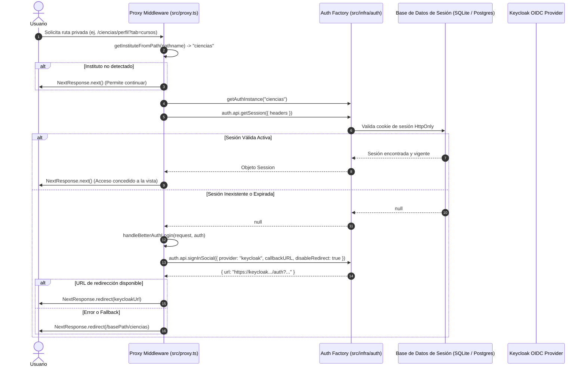

# 🛡️ Middleware de Enrutamiento e Interceptor de Autenticación (`proxy.ts`)

> **Capa**: Middleware de Enrutamiento / Redirección | **Framework**: Next.js 16 (App Router) | **Autenticación**: Better Auth & Keycloak (OIDC) | **Multi-Tenancy**: Basado en ruta (`/:institute`)

---

## 1. 📌 Introducción y Propósito

En Next.js 16, el archivo [`src/proxy.ts`](../src/proxy.ts) actúa como el **middleware e interceptor centralizado** en el borde de la red (Network Edge / Request Pipeline) de la aplicación frontend. Su función primordial es proteger rutas privadas y gestionar la redirección hacia el proveedor de identidad institucional (**Keycloak**) de forma transparente antes de que las páginas o Server Components comiencen a renderizarse.

### Objetivos Principales:
1. **Protección de Rutas Privadas**: Evitar que usuarios no autenticados accedan a páginas restringidas como el perfil de usuario o la gestión de solicitudes docentes.
2. **Aislamiento Multi-Tenant**: Detectar dinámicamente el instituto (`tenant`) a partir del segmento de la URL (`/:institute/...`) e instanciar el cliente de autenticación correspondiente.
3. **Flujo SSO Transparente**: Si una sesión no existe o ha expirado, iniciar automáticamente la negociación OIDC con Keycloak conservando la URL de retorno (`callbackURL`) para redirigir al usuario exactamente a donde se dirigía una vez autenticado.
4. **Optimización de Rendimiento**: Al filtrar las rutas mediante `config.matcher`, el proxy solo se ejecuta en las rutas que expresamente requieren validación de sesión, minimizando la sobrecarga en activos estáticos o rutas públicas.

---

## 🏗️ 2. Ubicación y Estructura en el Proyecto

```
frontend/
├── src/
│   ├── proxy.ts                  # 🛡️ Interceptor y middleware de autenticación OIDC multitenant
│   ├── infra/
│   │   └── auth/
│   │       ├── auth-factory.ts   # Factoría que produce instancias de Better Auth por instituto
│   │       └── auth-session.ts   # Utilidades de sesión y cookies
│   └── app/
│       └── [institute]/          # Segmento de ruta dinámica multitenant
│           ├── perfil/           # 🔒 Ruta protegida
│           └── [courseId]/
│               └── solicitudes/  # 🔒 Ruta protegida
└── docs/
    ├── arquitectura-frontend.md
    ├── autenticacion-y-base-de-datos.md
    └── proxy.md                  # 📖 Este documento
```

---

## 🔄 3. Diagrama de Flujo del Proxy

El siguiente diagrama detalla la toma de decisiones que realiza `proxy.ts` ante cada petición entrante:



---

## 🔍 4. Desglose del Código Fuente

A continuación se explica cada sección de [`src/proxy.ts`](../src/proxy.ts):

### 4.1 Función Principal: `proxy(request)`

```typescript
export async function proxy(request: NextRequest) {
  // 1. Extrae el identificador del instituto de la URL
  const institute = getInstituteFromPath(request.nextUrl.pathname);
  if (!institute) return NextResponse.next();

  // 2. Obtiene la instancia de autenticación configurada para este instituto
  const auth = getAuthInstance(institute);
  const session = await auth.api.getSession({ headers: await headers() });
  
  // 3. Si la sesión ya existe y es válida, permite continuar la navegación
  if (session) return NextResponse.next();

  // 4. Si no hay sesión, genera la URL de login en Keycloak
  const result = await handleBetterAuthLogin(request, auth);

  // 5. Redirige a Keycloak preservando el callback
  if (result?.url) {
    return NextResponse.redirect(result.url);
  }

  // 6. En caso de no obtener URL, fallback seguro a la página principal del instituto
  const basePath = process.env.NEXT_PUBLIC_BASE_PATH ?? "";
  return NextResponse.redirect(new URL(`${basePath}/${institute}`, request.url));
}
```

- **`headers()`**: Se obtienen las cabeceras HTTP del servidor para evaluar la cookie de sesión (`better-auth.session_token`).
- **`NextResponse.next()`**: Pasa el control al siguiente handler o render de la página.
- **`NextResponse.redirect(url)`**: Responde inmediatamente al navegador con un código de redirección HTTP 307/302.

---

### 4.2 Negociación de Login OIDC: `handleBetterAuthLogin`

```typescript
async function handleBetterAuthLogin(request: NextRequest, auth: AuthInstance) {
  const basePath = process.env.NEXT_PUBLIC_BASE_PATH ?? "";
  // Construye la URL exacta a la que debe volver el usuario tras autenticarse
  const callbackURL = `${basePath}${request.nextUrl.pathname}${request.nextUrl.search}`;

  const result = await auth.api.signInSocial({
    body: {
      provider: "keycloak",
      disableRedirect: true,
      callbackURL: callbackURL,
    },
    headers: await headers(),
  });

  return result;
}
```

> [!IMPORTANT]
> **¿Por qué `disableRedirect: true`?**
> Por defecto, Better Auth intenta realizar una redirección automática en el contexto del endpoint API. Dentro de `proxy.ts`, necesitamos que devuelva la URL calculada (`result.url`) para que el middleware de Next.js genere un `NextResponse.redirect()` controlado que no rompa el pipeline de Edge/Node.

- **`callbackURL`**: Incluye el `pathname` y los query parameters (`search`), asegurando que tras identificarse en Keycloak, el usuario regrese con el estado exacto solicitado (ej. `/:institute/:courseId/solicitudes?tab=pendientes`).

---

### 4.3 Extracción del Tenant: `getInstituteFromPath`

```typescript
function getInstituteFromPath(pathname: string) {
  const [institute] = pathname.split("/").filter(Boolean);
  return institute;
}
```

- Divide la ruta por diagonales omitiendo segmentos vacíos.
- El primer segmento no vacío corresponde al tenant institucional (ej. en `/ciencias/perfil` retorna `"ciencias"`).

---

### 4.4 Configuración del Matcher: `config.matcher`

```typescript
export const config = {
  matcher: ["/:institute/perfil", "/:institute/:courseId/solicitudes"],
};
```

El matcher define los patrones de ruta de Next.js que activarán la ejecución del proxy:

| Ruta Coincidente | Propósito | Roles Comunes |
|---|---|---|
| `/:institute/perfil` | Panel personal del usuario logueado | Estudiantes, Profesores, Administradores |
| `/:institute/:courseId/solicitudes` | Aprobación/Rechazo de solicitudes de inscripción | Docentes y Coordinadores |

> [!TIP]
> **Cómo proteger una nueva ruta**:
> Si se crea una nueva página privada (por ejemplo, una pantalla de configuración o administración), basta con añadir el patrón correspondiente al array `matcher`:
> ```typescript
> export const config = {
>   matcher: [
>     "/:institute/perfil",
>     "/:institute/:courseId/solicitudes",
>     "/:institute/admin/:path*", // Nueva ruta protegida
>   ],
> };
> ```

---

## ⚙️ 5. Variables de Entorno Relevantes

El comportamiento de `proxy.ts` y su route handler dinámico depende de las siguientes variables de entorno:

| Variable | Tipo | Descripción | Ejemplo |
|---|---|---|---|
| `NEXT_PUBLIC_BASE_PATH` | Opcional | Subruta base donde se sirve la aplicación (útil para deployments bajo prefijos como `/macti`). | `"/macti"` |
| `NEXT_PUBLIC_APP_URL` | Requerido | URL pública base para reconstruir URLs canónicas y retornos OAuth. | `"https://tlapoa.lamod.unam.mx/macti"` |
| `DATABASE_PROVIDER` | Requerido | Proveedor de BD para validar la sesión (`sqlite` en local, `postgres` en prod). | `"sqlite"` |
| `K8S_API_URL` | Requerido | URL interna del backend REST en el clúster a la que se reenviarán peticiones proxy. | `"http://macti-backend-service:8000"` |
| `NEXT_PUBLIC_<INSTITUTO>_KEYCLOAK_ISSUER` | Requerido | URL del realm/issuer de Keycloak por instituto consumida por `auth-factory.ts`. | `"https://sso.lamod.unam.mx/auth/realms/ciencias"` |

> [!TIP]
> Consulta la guía maestra de [Variables de Entorno](./variables-entorno.md) para conocer el ciclo de vida de estas variables y su configuración en Docker y Kubernetes.

---

## 🛡️ 6. Buenas Prácticas y Consideraciones

1. **Mantener el Matcher Específico**: No utilices matchers universales como `/:path*` a menos que sea estrictamente necesario. Esto previene llamadas innecesarias a la base de datos de sesión en páginas públicas o estáticas (como la página de inicio o el catálogo de cursos).
2. **Compatibilidad con `NEXT_PUBLIC_BASE_PATH`**: Todo redireccionamiento y cálculo de `callbackURL` debe considerar el prefijo `basePath` para evitar redirecciones rotas cuando el frontend se despliega detrás de un reverse proxy (Ingress/Nginx).
3. **Manejo de Errores y Fallbacks**: Si Keycloak no responde o `result.url` es nulo, el proxy redirige de manera segura a la raíz del instituto (`/${institute}`) en lugar de generar un error 500.

---

## 🔗 7. Documentación Relacionada

- [Variables de Entorno](variables-entorno.md)
- [Arquitectura del Frontend](arquitectura-frontend.md)
- [Autenticación OIDC y Base de Datos de Sesiones](autenticacion-y-base-de-datos.md)
- [Requerimientos del Frontend (RNF-03.4)](requerimientos-frontend.md)
- [Guía de Creación de Servicios](guia-creacion-servicios.md)
