# 📋 Requerimientos Funcionales y No Funcionales - Frontend (MACTI)

> **Actualizado**: Julio 2026

---

## 1. 📌 Introducción y Propósito

El presente documento define formalmente la especificación de **Requerimientos Funcionales (RF)** y **Requerimientos No Funcionales (RNF)** para la aplicación **Frontend** de la plataforma **MACTI**.

El objetivo principal del Frontend de MACTI es proporcionar un **dashboard centralizado** interactivo, responsivo y accesible que unifique el flujo operativo, la administración de usuarios y la gestión de cursos con soporte multi-institucional. A través de este panel, estudiantes, docentes y administradores pueden gestionar inscripciones a los cursos.

---

## 🏗️ 2. Arquitectura de Referencia del Frontend

La aplicación cliente está desarrollada sobre las siguientes tecnologías base:

* **Framework Principal**: Next.js 16+ (App Router con Server & Client Components)
* **Librería de UI**: React 19 y Tailwind CSS 4
* **Componentes UI**: Componentes accesibles basados en Radix UI / Shadcn UI
* **Gestión de Estado**: Zustand (Estado cliente global) y TanStack React Query v5 (Estado de servidor y caché)
* **Validación de Datos**: Zod
* **Autenticación**: Better Auth / Integración Backend SSO (Keycloak, Moodle)
* **Calidad de Código y Estilo**: Biome (Linter y formateador estricto) + TypeScript 6

---

## ⚙️ 3. Requerimientos Funcionales (RF)

Los requerimientos funcionales describen los comportamientos, servicios y capacidades específicas que la interfaz de usuario debe proveer a los diferentes tipos de usuarios (Estudiante, Docente, Administrador).

### 🔑 Módulo 1: Autenticación y Gestión de Usuarios

| ID | Nombre | Descripción | Prioridad | Actores |
|---|---|---|---|---|
| **RF-01** | Inicio de Sesión de Usuarios | El sistema debe permitir a los usuarios autenticarse mediante credenciales Single Sign-On (SSO Keycloak). | Alta | Todos los usuarios |
| **RF-02** | Flujo de Registro de Usuarios e Institución | El sistema debe permitir el registro de nuevos usuarios capturando nombre, apellido, correo institucional, contraseña y la selección obligatoria de su instituto/facultad de origen. | Alta | Estudiante, Docente |
| **RF-03** | Selección de Rol durante Registro | Al registrarse, el usuario debe poder solicitar un rol dentro de la plataforma (Alumno o Docente). | Alta | Estudiante, Docente |
| **RF-04** | Gestión de Sesión y Cierre de Sesión | El frontend debe mantener la sesión activa de forma segura mediante tokens (cookies HTTP-only) y ofrecer la opción explícita de cerrar sesión en cualquier momento. | Alta | Todos los usuarios |

---

### 🏫 Módulo 2: Navegación Multitenant e Institucional

| ID | Nombre | Descripción | Prioridad | Actores |
|---|---|---|---|---|
| **RF-05** | Rutas Dinámicas por Instituto | La aplicación debe ofrecer una estructura de navegación dinámica basada en el identificador del instituto (`/[institute]`). | Alta | Todos los usuarios |
| **RF-06** | Catálogo de Cursos por Instituto | El usuario debe poder consultar el listado de cursos y asignaturas pertenecientes a su instituto seleccionado (`/[institute]/[course_id]`). | Alta | Estudiante, Docente |
| **RF-07** | Filtrado y Búsqueda de Cursos | La interfaz debe ofrecer controles de búsqueda en tiempo real y filtrado de cursos por nombre, código, semestre o profesor a cargo. | Media | Estudiante, Docente |

---

### 📝 Módulo 3: Gestión de Solicitudes e Inscripciones a Cursos

| ID | Nombre | Descripción | Prioridad | Actores |
|---|---|---|---|---|
| **RF-08** | Envío de Solicitud de Inscripción | Los estudiantes deben poder solicitar la inscripción a un curso específico dentro de su instituto. | Alta | Estudiante |
| **RF-09** | Panel de Gestión de Solicitudes (Docente/Admin) | Los profesores o administradores deben disponer de una vista (`/[institute]/[course_id]/solicitudes`) para revisar las solicitudes recibidas. | Alta | Docente, Admin |
| **RF-10** | Transiciones de Estado de Inscripción | El sistema debe permitir a los docentes/administradores cambiar el estado de las solicitudes mediante acciones explícitas: `Aprobar` (`approved`), `Rechazar` (`rejected`), `Inscribir` (`enrolled`) o `Eliminar`. | Alta | Docente, Admin |
| **RF-11** | Visualización de Badges de Estado | La interfaz debe presentar etiquetas visuales distintivas (*Badges*) que indiquen el estado de la solicitud del usuario (`Pendiente`, `Aprobada`, `Rechazada`, `Inscrito`). | Media | Estudiante, Docente |

---

### 👤 Módulo 4: Perfil de Usuario y Ajustes

| ID | Nombre | Descripción | Prioridad | Actores |
|---|---|---|---|---|
| **RF-12** | Perfil de Usuario | Vista dedicada (`/[institute]/perfil`) donde el usuario puede consultar su información personal, rol actual e historia de cursos inscritos o impartidos. | Media | Todos los usuarios |
| **RF-13** | Edición de Datos de Perfil | El usuario debe poder actualizar su nombre, fotografía/avatar y preferencias de notificación. | Baja | Todos los usuarios |

---

## 🚀 4. Requerimientos No Funcionales (RNF)

Los requerimientos no funcionales definen los atributos de calidad, rendimiento, seguridad, usabilidad y mantenibilidad del sistema frontend.

### ⚡ RNF-01: Rendimiento y Optimización (Performance)

* **RNF-01.1 Tiempos de Carga (Core Web Vitals)**:
  * **LCP (Largest Contentful Paint)**: < 2.5 segundos en conexiones de velocidad media (4G).
  * **INP (Interaction to Next Paint)**: < 200 ms.
  * **CLS (Cumulative Layout Shift)**: < 0.1.
* **RNF-01.2 Renderizado Híbrido**: Aprovechar Server Components (RSC) en Next.js para reducir la transferencia del paquete JavaScript enviado al navegador.
* **RNF-01.3 Gestión de Caché e Stale Data**: Utilizar **TanStack React Query** para el almacenamiento en caché de peticiones al Backend, reduciendo peticiones innecesarias a la API REST.

---

### 🎨 RNF-02: Usabilidad, Diseño y Experiencia de Usuario (UX/UI)

* **RNF-02.1 Diseño Responsivo**: La interfaz debe adaptarse de forma óptima a pantallas móviles (320px+), tablets (768px+) y computadoras de escritorio (1024px+).
* **RNF-02.2 Estética y Sistema de Diseño**: Uso estricto de Tailwind CSS v4 junto con componentes Shadcn/Radix UI, garantizando paletas de color accesibles, tipografía clara y microinteracciones fluidas.
* **RNF-02.3 Retroalimentación en Tiempo Real**: Toda acción asíncrona (guardar, actualizar estado, solicitar inscripción) debe presentar estados de carga (*spinners*, *skeletons*) y notificaciones emergentes (*toasts*) ante éxito o fallo.

---

### 🔒 RNF-03: Seguridad en el Frontend

* **RNF-03.1 Manejo de Tokens y Autenticación**: Los tokens de sesión JWT deben almacenarse en cookies seguras con directivas `HttpOnly`, `SameSite=Lax` y `Secure`.
* **RNF-03.2 Sanitización y Validaciones de Entrada**: Todos los formularios deben ser convalidados en el cliente con **Zod** antes de ser enviados al servidor para prevenir inyecciones.
* **RNF-03.3 Protección contra XSS y CSRF**: Evitar la inyección directa de HTML sin sanitizar (`dangerouslySetInnerHTML`) y aplicar headers de seguridad HTTP en la configuración de Next.js.
* **RNF-03.4 Rutas Protegidas y Middleware**: Las vistas administrativas y de docentes deben estar resguardadas mediante middleware de Next.js (`proxy.ts` / `middleware.ts`), reorientando usuarios no autorizados a la página de login.

---

### 🧹 RNF-04: Mantenibilidad y Calidad de Código

* **RNF-04.1 Estándar de Código y Formateo**: El código fuente debe pasar exitosamente las verificaciones del linter/formateador **Biome** (`pnpm lint`).
* **RNF-04.2 Tipado Estricto**: Uso obligatorio de TypeScript en modo estricto (`tsconfig.json`), prohibiendo el uso injustificado del tipo `any`.
* **RNF-04.3 Documentación de Código**: Componentes principales, hooks y funciones del dominio deben incluir bloques de comentarios **JSDoc** explicando sus parámetros y propósito.
* **RNF-04.4 Arquitectura por Dominios**: El código dentro de `src/` debe respetar la arquitectura por dominios modularizada (`domains/auth`, `domains/courses`, `domains/users`, `shared/`).

---

### ♿ RNF-05: Accesibilidad (a11y)

* **RNF-05.1 Estándar WCAG**: Cumplimiento básico con las pautas de accesibilidad **WCAG 2.1 Nivel AA**.
* **RNF-05.2 Semántica HTML y Atributos ARIA**: Empleo de elementos semánticos HTML5 (`<header>`, `<main>`, `<nav>`, `<article>`) y atributos `aria-*` provistos por los primitivos de Radix UI.
* **RNF-05.3 Navegación por Teclado**: Todos los elementos interactivos (botones, enlaces, modales, selectores) deben ser operables mediante teclado (teclas `Tab`, `Enter`, `Space`, `Escape`).

---

### 🌐 RNF-06: Compatibilidad de Navegadores

* **RNF-06.1 Navegadores Soportados**: Soporte nativo y sin degradación funcional en las versiones más recientes de:
  * Google Chrome / Chromium
  * Mozilla Firefox
  * Apple Safari (macOS / iOS)
  * Microsoft Edge

---

## 📊 5. Matriz de Priorización de Requerimientos

```mermaid
flowchart TB
    subgraph QuadCritica ["🔴 Prioridad Crítica (Inmediato: Baja Complejidad / Alto Impacto)"]
        direction TB
        RF01["RF-01 Autenticación SSO Keycloak"]
        RF02["RF-02 Registro de Usuarios"]
        RF06["RF-06 Rutas Multitenant por Instituto"]
        RF09["RF-09 Solicitudes de Cursos"]
        RNF03["RNF-03 Seguridad en Autenticación"]
        RNF04["RNF-04 Calidad y Linter Biome"]
    end

    subgraph QuadAlta ["🟠 Prioridad Alta (Planificar: Alta Complejidad / Alto Impacto)"]
        direction TB
        RF10["RF-10 Panel de Gestión de Solicitudes"]
        RF13["RF-13 Visor de Notebooks Interactivos"]
        RF14["RF-14 Graficación Interactiva 2D/3D"]
        RNF01["RNF-01 Rendimiento y Core Web Vitals"]
    end

    subgraph QuadMedia ["🟡 Prioridad Media (Evaluar: Alta Complejidad / Bajo Impacto)"]
        direction TB
        RF17["RF-17 Edición Avanzada de Perfil"]
    end

    subgraph QuadBaja ["🟢 Prioridad Baja (Deseable: Baja Complejidad / Bajo Impacto)"]
        direction TB
        RF15["RF-15 Exportación y Descarga de Materiales"]
    end
```

### Tabla de Clasificación por Cuadrantes

| Cuadrante | Nivel de Impacto | Complejidad Técnica | Requerimientos Incluidos | Acción Recomenda |
|---|---|---|---|---|
| **🔴 Prioridad Crítica** | Alto Impacto | Baja Complejidad | `RF-01`, `RF-02`, `RF-06`, `RF-09`, `RNF-03`, `RNF-04` | Implementación Inmediata |
| **🟠 Prioridad Alta** | Alto Impacto | Alta Complejidad | `RF-10`, `RF-13`, `RF-14`, `RNF-01` | Planificación y Arquitectura |
| **🟡 Prioridad Media** | Bajo Impacto | Alta Complejidad | `RF-17` | Evaluar costo / beneficio |
| **🟢 Prioridad Baja** | Bajo Impacto | Baja Complejidad | `RF-15` | Implementar en fases posteriores |

---

## 📄 6. Conclusión y Próximos Pasos

Este documento sirve como la especificación formal del Frontend de MACTI. Cualquier adición de nuevas características o refactorización del código debe alinearse con los requerimientos funcionales y de calidad aquí descritos.
