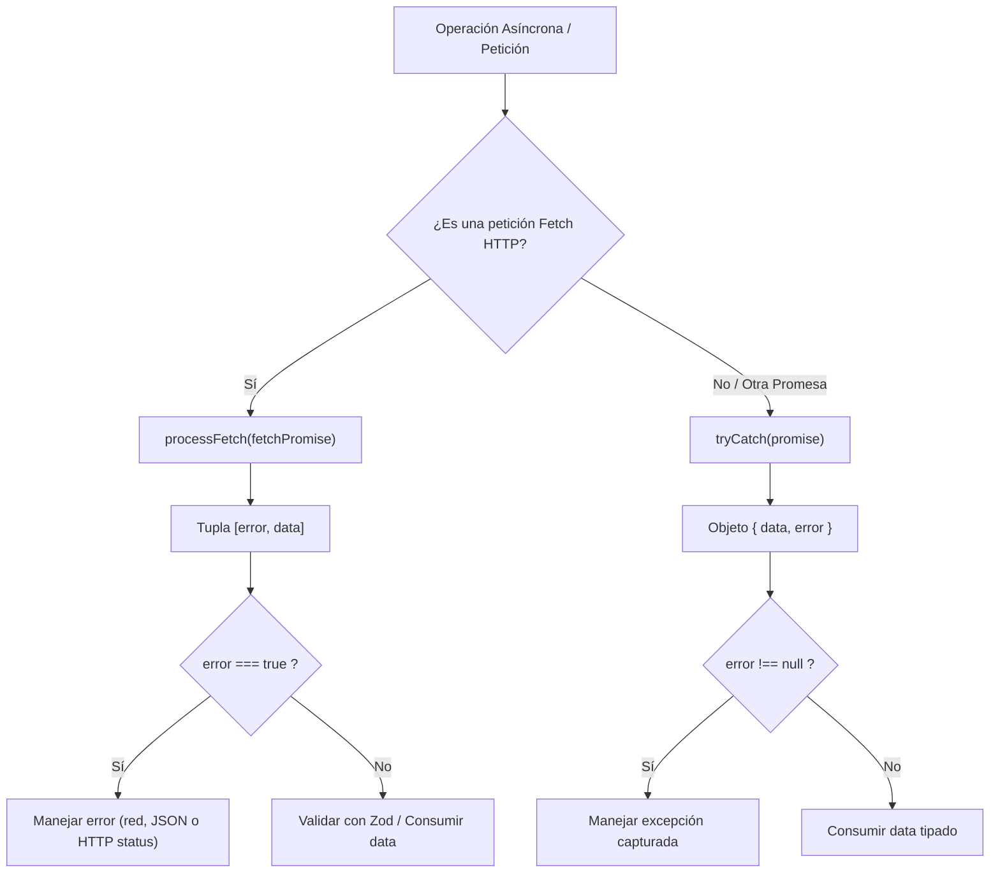
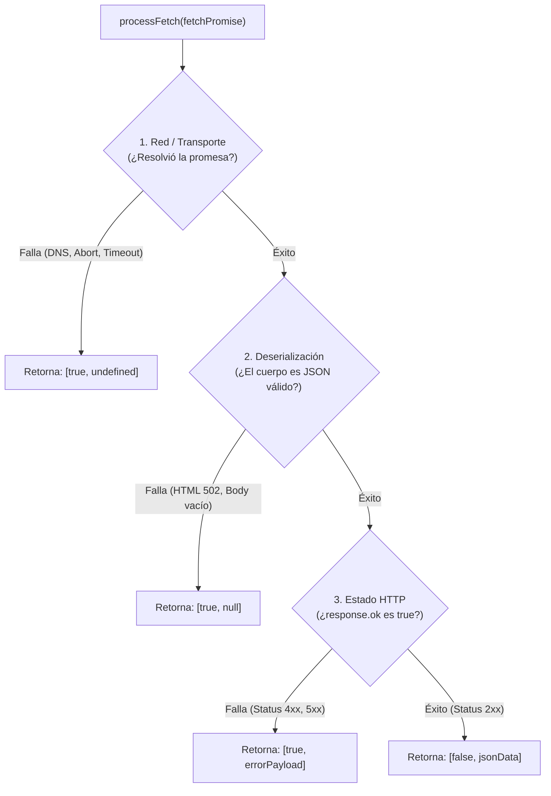

# 🛠️ Utilidades Compartidas (`src/shared/utils`)

> Módulo central de funciones auxiliares puras y seguras para el manejo asíncrono, control de errores tipado y consumo estandarizado de APIs en el frontend de MACTI.

---

## 📑 Tabla de Contenidos

1. [Visión General y Filosofía de Diseño](#-visión-general-y-filosofía-de-diseño)
2. [Utilidad: `tryCatch`](#-utilidad-trycatch)
   - [Firma Técnica y Tipos](#firma-técnica-y-tipos)
   - [¿Cómo Funciona?](#cómo-funciona)
   - [Beneficios Clave](#beneficios-clave)
   - [Casos de Uso Principales](#casos-de-uso-principales)
   - [Ejemplos de Código](#ejemplos-de-código)
3. [Utilidad: `processFetch`](#-utilidad-processfetch)
   - [Firma Técnica y Tipos](#firma-técnica-y-tipos-1)
   - [Los 3 Niveles de Falla en Fetch](#los-3-niveles-de-falla-en-fetch)
   - [Beneficios Clave](#beneficios-clave-1)
   - [Casos de Uso Principales](#casos-de-uso-principales-1)
   - [Ejemplos de Código](#ejemplos-de-código-1)
4. [Matriz Comparativa: `tryCatch` vs. `processFetch`](#-matriz-comparativa-trycatch-vs-processfetch)
5. [Guía de Integración y Buenas Prácticas](#-guía-de-integración-y-buenas-prácticas)

---

## 🎯 Visión General y Filosofía de Diseño

En aplicaciones modernas construidas con React y Next.js, uno de los puntos críticos de inestabilidad y complejidad es el manejo de operaciones asíncronas y consumo de servicios de red. El uso tradicional de bloques imperativos `try/catch` genera problemas recurrentes:

- **Código "piramidal" o anidado**: Múltiples niveles de indentación que oscurecen el flujo principal.
- **Variables mutables en ámbito externo**: Necesidad de declarar variables con `let` fuera del bloque `try` para poder utilizarlas posteriormente.
- **Pérdida de inferencia de tipos**: En TypeScript, las variables capturadas en `catch (error)` son de tipo `unknown`, requiriendo aserciones manuales propensas a errores.
- **Gotchas nativos de `fetch`**: La función nativa `fetch()` **no rechaza la promesa ante códigos de error HTTP 4xx o 5xx**; únicamente falla ante desconexiones de red, lo que suele provocar que respuestas de error pasen inadvertidas.

El módulo `src/shared/utils/` soluciona estos problemas adoptando el **Result Pattern** (inspirado en lenguajes como Go o Rust y en propuestas de asignación segura de ECMAScript), transformando errores no controlados en **valores predecibles y estrictamente tipados**.



---

## 🛡️ Utilidad: `tryCatch`

Ubicación: [`src/shared/utils/try-catch.ts`](../src/shared/utils/try-catch.ts)

Wrapper genérico para cualquier `Promise<T>`. Atrapa cualquier excepción rechazada y la convierte en un objeto discriminado `{ data, error }`.

### Firma Técnica y Tipos

```typescript
interface Success<T> {
  data: T;
  error: null;
}

interface Failure<E> {
  data: null;
  error: E;
}

export type Result<T, E = Error> = Success<T> | Failure<E>;

export async function tryCatch<T, E = Error>(
  promise: Promise<T>
): Promise<Result<T, E>>;
```

### ¿Cómo Funciona?

1. Ejecuta `await promise` dentro de un bloque `try` encapsulado.
2. Si la promesa se resuelve exitosamente, retorna `{ data, error: null }`.
3. Si la promesa falla o arroja una excepción, la atrapa y retorna `{ data: null, error: error as E }`.

### Beneficios Clave

- **Control de Flujo Lineal (Early Exit)**: Permite verificar inmediatamente si hubo un error (`if (result.error) return ...`) y continuar el flujo de forma plana, sin sangrías ni anidamientos.
- **Inferencia y Type Narrowing Automático**: Como `Result<T, E>` es una unión discriminada, al validar `if (error)`, TypeScript reduce automáticamente el tipo de `data` a `T` en el resto del bloque:
  ```typescript
  const { data, error } = await tryCatch(miOperacion());
  if (error) {
    // Aquí data es estrictamente null
    return;
  }
  // Aquí data es estrictamente T
  ```
- **Eliminación de Variables Mutables (`let`)**: No es necesario declarar `let resultado;` fuera de un bloque para asignarlo dentro del `try`.
- **Universal y Desacoplado**: Funciona con **cualquier** promesa (lectura de I/O, llamadas a librerías de terceros, parseo asíncrono, etc.).

### Casos de Uso Principales

1. **Rutas Proxy y Handlers de API (`route.ts`)**: Controlar peticiones reenviadas donde se desea retornar respuestas HTTP controladas ante cualquier fallo.
2. **Parseo Asíncrono de Streams y Cuerpos**: Convertir de forma segura respuestas a JSON (`tryCatch(response.json())`) o blobs sin riesgo de excepciones no capturadas.
3. **Llamadas a Clientes Externos y SDKs**: Invocar métodos de autenticación (Better Auth, Keycloak) o servicios que puedan arrojar excepciones inesperadas.

### Ejemplos de Código

#### ❌ Antes (Enfoque Tradicional con `try/catch`)
```typescript
let userData: User | null = null;

try {
  const response = await fetchUserData();
  userData = response;
} catch (err) {
  console.error("Error al obtener usuario:", err);
  return null;
}

// Continuar usando userData
return userData;
```

#### ✅ Después (Con `tryCatch`)
```typescript
import { tryCatch } from "@/shared/utils/try-catch";

const { data: userData, error } = await tryCatch(fetchUserData());

if (error) {
  console.error("Error al obtener usuario:", error);
  return null;
}

// userData tiene tipo User garantizado e inferido
return userData;
```

#### 🔍 Ejemplo Real en el Proyecto: Interceptor Proxy (`proxyToApi`)
Ubicación: [`src/app/api/proxy/[institute]/[[...path]]/route.ts`](../src/app/api/proxy/%5Binstitute%5D/%5B%5B...path%5D%5D/route.ts)

```typescript
// 1. Ejecutar la llamada de red con tryCatch
const response = await tryCatch(requestPromise);
if (response.error) {
  return NextResponse.json(
    { error: "Error al obtener datos de la API" },
    { status: 500 },
  );
}

// 2. Parsear el cuerpo JSON de forma segura con tryCatch
const responseData = await tryCatch(response.data.json());
if (responseData.error) {
  return NextResponse.json(
    { error: "Error al analizar la respuesta de la API" },
    { status: 500 },
  );
}

return NextResponse.json(responseData.data, { status: response.data.status });
```

---

## 🌐 Utilidad: `processFetch`

Ubicación: [`src/shared/utils/process-fetch.ts`](../src/shared/utils/process-fetch.ts)

Orquestador especializado para consumir servicios HTTP mediante `fetch`. Aborda de forma exhaustiva los **tres puntos de falla** inherentes a las solicitudes HTTP en JavaScript y entrega una tupla ergonómica `[error, data]`.

### Firma Técnica y Tipos

```typescript
export type Success = [error: false, data: unknown];

export type Failure = [
  error: true,
  data: null | undefined | { error_code?: string; message?: string },
];

export type FetchResult = Success | Failure;

export async function processFetch(
  fetchPromise: Promise<Response>,
): Promise<FetchResult>;
```

### Los 3 Niveles de Falla en Fetch

La función nativa `window.fetch` o `fetch` de Node.js presenta tres posibles puntos de ruptura con comportamientos dispares:



| Nivel de Falla | Causa Típica | Resultado Devuelto por `processFetch` |
|---|---|---|
| **1. Transporte / Red** | Caída de conexión, error DNS, timeout, cancelación de la petición. | `[true, undefined]` |
| **2. Deserialización JSON** | Respuesta vacía, respuesta en HTML plano (ej. página 502/504 devuelta por NGINX/Ingress de K8s). | `[true, null]` |
| **3. Estado HTTP (`!response.ok`)** | Códigos de cliente o servidor (400, 401, 403, 404, 409, 500). El backend devolvió un payload con el detalle del error. | `[true, { error_code?, message? }]` |
| **Éxito Total** | HTTP 2xx con cuerpo JSON válido. | `[false, data]` |

### Beneficios Clave

- **Solución al Falso Éxito de `fetch`**: Normaliza cualquier código de error HTTP (4xx o 5xx) como `error = true`.
- **Desestructuración Ergonómica de Tupla**: Sintaxis inmediata y limpia: `const [error, data] = await processFetch(...)`.
- **Extracción Automática de Errores de Negocio**: Si el backend de MACTI responde con un error HTTP (por ejemplo, `409 Conflict: { error_code: "USER_EXISTS", message: "El usuario ya está registrado" }`), dicho objeto queda accesible directamente en `data` cuando `error === true`.
- **Integración Natural con Zod**: Diseñado para encadenarse directamente con `schema.safeParse(data)` en la capa de servicios.
- **Estandarización en Todo el Proyecto**: Todos los dominios (`courses`, `register`, `users`) consumen APIs bajo el mismo patrón consistente.

### Casos de Uso Principales

1. **Servicios de Lectura de Dominio (`GET`)**: Obtener información de usuario, catálogos de cursos, listas de solicitudes.
2. **Servicios de Mutación (`POST`, `PUT`, `PATCH`, `DELETE`)**: Creación de cuentas de profesores/alumnos, actualización de estados, inscripciones.
3. **Consumo de la API K8s / Backend FastAPI**: Manejo transparente de respuestas estructuradas o fallos del clúster.

### Ejemplos de Código

#### ❌ Antes (Sin `processFetch`)
```typescript
async function fetchCourses() {
  try {
    const res = await fetch("https://api.macti.unam.mx/courses");
    if (!res.ok) {
      const errorJson = await res.json().catch(() => null);
      console.error("Error del servidor:", errorJson);
      return null;
    }
    const data = await res.json();
    return data;
  } catch (networkError) {
    console.error("Error de red:", networkError);
    return null;
  }
}
```

#### ✅ Después (Con `processFetch`)
```typescript
import { processFetch } from "@/shared/utils/process-fetch";

async function fetchCourses() {
  const [error, data] = await processFetch(
    fetch("https://api.macti.unam.mx/courses")
  );

  if (error) {
    // data puede ser undefined (red), null (json inválido) o { message, error_code }
    console.error("Fallo al consultar cursos:", data);
    return null;
  }

  return data;
}
```

#### 🔍 Ejemplo Real en el Proyecto: Servicio de Registro (`fetchAccountInfo`)
Ubicación: [`src/domains/register/services/fetchAccountInfo.ts`](../src/domains/register/services/fetchAccountInfo.ts)

```typescript
import { processFetch } from "@/shared/utils/process-fetch";
import { fetchAccountInfoResponseSchema } from "../schemas/createAccountSchema";

export async function fetchAccountInfo(token: string) {
  const verifyTokenPromise = fetch(
    `${process.env.K8S_API_URL}/register/user-info-by-token?token=${token}`,
    {
      method: "GET",
      cache: "no-store",
    },
  );

  // 1. Procesa la respuesta HTTP y captura cualquier fallo
  const [error, userData] = await processFetch(verifyTokenPromise);
  if (error) return undefined;

  // 2. Valida la estructura esperada de los datos mediante Zod
  const parsedUserData = fetchAccountInfoResponseSchema.safeParse(userData);
  if (!parsedUserData.success) return undefined;

  return parsedUserData.data;
}
```

---

## ⚖️ Matriz Comparativa: `tryCatch` vs. `processFetch`

| Criterio | `tryCatch` | `processFetch` |
|---|---|---|
| **Archivo** | `try-catch.ts` | `process-fetch.ts` |
| **Entrada esperada** | Cualquier `Promise<T>` genérica | Una promesa de `Response`: `Promise<Response>` |
| **Estructura de Retorno** | Objeto: `{ data: T \| null, error: E \| null }` | Tupla: `[error: boolean, data: unknown]` |
| **Manejo de HTTP Status (4xx/5xx)** | No lo evalúa (sólo evalúa si la promesa resolvió o rechazó) | Sí: marca `error: true` cuando `!response.ok` y extrae el cuerpo |
| **Parseo de JSON** | No lo realiza automáticamente | Sí: ejecuta `.json()` de forma segura con `tryCatch` interno |
| **Dependencias internas** | Ninguna (función pura básica) | Depende de `tryCatch` |
| **Cuándo usarlo** | En handlers generales, proxies, llamadas a librerías, o promesas que no sean `fetch` directamente. | En **todos** los servicios de dominio (`src/domains/*/services/`) al hacer peticiones HTTP. |

---

## 📋 Guía de Integración y Buenas Prácticas

### 1. Flujo Estándar en Servicios de Dominio

Al crear un nuevo servicio en `src/domains/<modulo>/services/`, sigue siempre esta secuencia:

```typescript
import { processFetch } from "@/shared/utils/process-fetch";
import { miEsquemaResponse } from "../schemas/miEsquema";

export async function miServicio(parametro: string) {
  // 1. Preparar la promesa fetch
  const peticion = fetch(`/api/proxy/mi-instituto/recurso`, {
    method: "POST",
    headers: { "Content-Type": "application/json" },
    body: JSON.stringify({ parametro }),
  });

  // 2. Procesar con processFetch
  const [error, rawData] = await processFetch(peticion);
  if (error) {
    // rawData contiene el mensaje de error del backend si existe
    return { success: false, error: rawData };
  }

  // 3. Validar con Zod de forma segura
  const validacion = miEsquemaResponse.safeParse(rawData);
  if (!validacion.success) {
    return { success: false, error: "Formato de respuesta inesperado" };
  }

  // 4. Retornar datos fuertemente tipados
  return { success: true, data: validacion.data };
}
```

### 2. Qué Evitar (Anti-Patrones)

- ❌ **Evitar envolver `processFetch` dentro de otro `try/catch`**: `processFetch` ya garantiza internamente que nunca lanzará una excepción no controlada.
- ❌ **Evitar asumir que `fetch()` rechazará ante errores 404 o 500**: Recuerda que `fetch()` nativo sólo arroja excepción si se corta la conexión; usa siempre `processFetch` para peticiones de red.
- ❌ **Evitar usar `as MyType` directamente sobre `rawData`**: Valida siempre el resultado exitoso con `Zod.safeParse(...)` para garantizar integridad en tiempo de ejecución.

---

## 🔗 6. Documentación Relacionada

* 🌐 [Variables de Entorno](./variables-entorno.md): Configuración de URLs base (`K8S_API_URL`, `NEXT_PUBLIC_APP_URL`) utilizadas en las peticiones procesadas por `processFetch`.
* 🌐 [Guía de Creación de Servicios y Validaciones](./guia-creacion-servicios.md): Integración de `processFetch` con esquemas Zod en la capa de dominios.
* 🏛️ [Arquitectura del Frontend](./arquitectura-frontend.md): Organización de módulos y utilidades transversales.
* 🛡️ [Middleware Proxy (`proxy.ts`)](./proxy.md): Uso de `tryCatch` en el reenvío de solicitudes al backend en Kubernetes.
